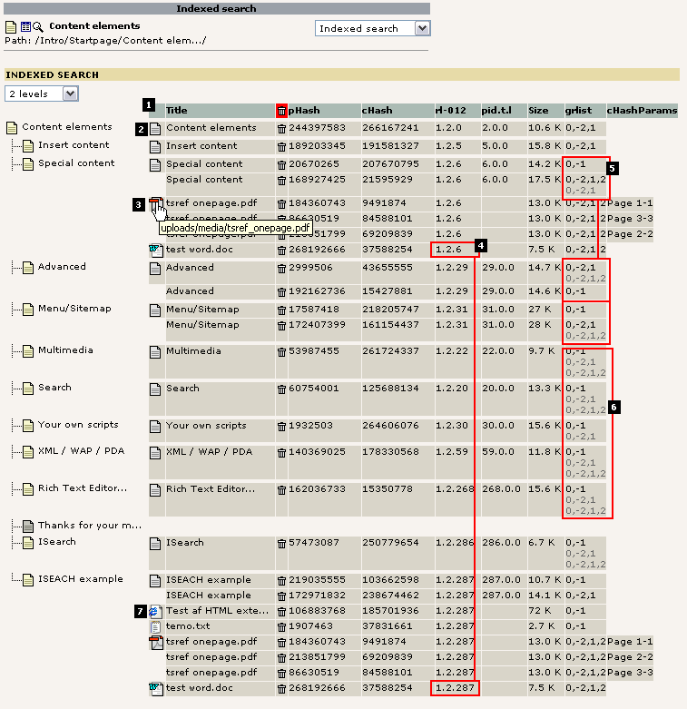
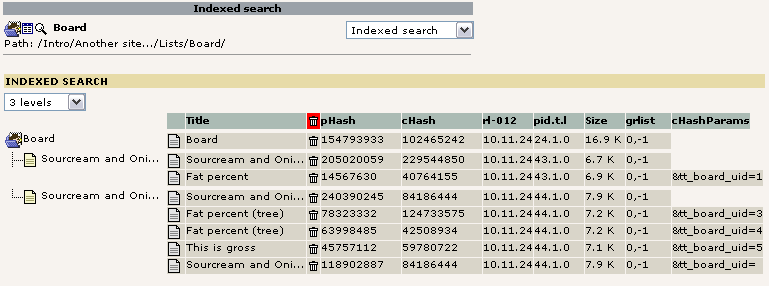
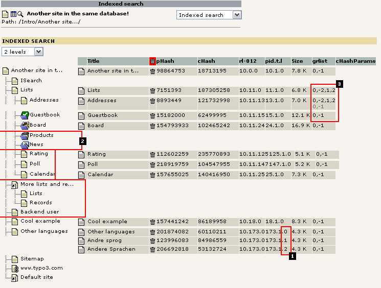
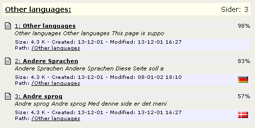

.. ==================================================
.. FOR YOUR INFORMATION
.. --------------------------------------------------
.. -*- coding: utf-8 -*- with BOM.

.. include:: ../Includes.txt

.. _analysing-indexed-data:

Analysing the indexed data
--------------------------

The indexer is constructed to work with TYPO3's page structure.
Opposite to a crawler which simply indexes all the pages it can find,
the TYPO3 indexer MUST take the following into account:

- Only cached pages can be indexed.Pages with dynamic content - such as
  search pages etc - should supply their own search engine for lookup in
  specific tables. Another option is to selectively allow certain of
  those "dynamic" pages to be cached anyway (see the cHashParams
  concept used by some plugins)

- Pages in more than one language must be indexed separately as
  "different pages".

- Pages with message boards may have multiple indexed versions based on
  what is displayed on the page: The overview or a single message board
  item? This is determined by the cHashParams value.

- Pages with access restricted to must be observed!

- Because pages can contain different content whether a user is logged
  in or not and even based on which groups he is a member of, a single
  page (identified by the combination of id/type/language/cHashParams)
  may even be available in more than one indexed version based on the
  user-groups. But while the same page may have different content based
  on the user-groups (and so must be indexed once for each) such pages
  may just as well present the SAME content regardless of usergroups!
  This is the very most tricky thing.

.. _complex-scenarios:

Understanding these complex scenarios...
^^^^^^^^^^^^^^^^^^^^^^^^^^^^^^^^^^^^^^^^

The best thing to do is to grab an example. Please refer to the
picture below while reading the bulletlist here:

#. The overview in general shows  **one line per "phash-row"** (a single
   row from the index\_phash table). Such a row represents a single hit
   in a searching session. In other words, each line with grayish
   background in the overview may be a search-hit. The columns of these
   rows are:

   - Title: The search-result title.

   - [icon]: Click here to remove the indexed information for this entry
     (will be re-indexed on the next hit).

   - pHash: The "id" of the search row. The hash is calculated based on
     id/type/language/MP/cHashParams/gr\_list of the page when indexed. For
     external media this is based on filepath/page-interval (for PDF's
     only)

   - cHash: Calculated based on the actual content which was indexed.

   - rl-012: This is the rootline ids for level 0,1,2. Used when searching
     in certain sections. For instance a search-operation may select all
     pages with rl1=123 which will result in a search within pages which
     exist ONLY in the branch of the website where the level1-page has
     uid=123.

   - pid.t.l: This is the page-id / type-number / sys\_language uid

   - Size: How many bytes the indexed page consumed

   - grlist: This is the gr\_list of the user which initiated the indexing
     operation.

   - cHashParams: Additional parameters which are identifying the page in
     addition to the id/type number which usually does that.

#. The page "Content elements" has one indexed version. The page-id of
   the root-page is "1" and the page on level-1 in the rootline had the
   uid "2". Notice how all subpages to "Content elements" has the exact
   same rl0 and rl1 value. Where the page "Content elements" does NOT
   have a value for rl2 so does all the subpages (because they ARE the
   level 2 themselves!). Furthermore the page has the page-id "2", a
   type-value of "0" and is indexed with the default language "0". The
   size was 10.6 KB and the user who initiated the indexing operation was
   a member of the groups 0,-2,1 (which is effectively fe\_group "1",
   because 0 and -2 is pseudogroups).

#. On the page "Special content" there must have been a link to a local
   PDF and Word file, since those two are indexed in relation to this
   page. The PDF-file is located in the path
   "uploads/media/tsref\_onepage.pdf" relative to the website. Notice
   that the PDF file is actually indexed three times, one time per page.
   This is of course configurable. Each indexed section of the PDF-file
   has the potential to show up as a search-result row of course (because
   the phash is different per indexed part). The whole point with this is
   that a large PDF file might contain so much information that it might
   match all too many search-queries. So breaking a PDF-file down into
   smaller parts makes it possible for us to indicate exactly WHERE in
   the PDF-file the search word was found!

#. Looking at the word file (and the PDF-file as well) we see that they
   are found on BOTH the page "Special content" and on the page "ISEARCH
   example". But looking at the phash values (for the word-file it is
   "268192666") it is the SAME value in both cases. So this means, that
   the Word and PDF file is indexed only once - when it is first
   discovered! Later when another page is indexed and a link to the same
   document appears, then the document is not indexed as another
   document, but rather an entry in the index\_section table is made
   indicating that this result row is also found available (linked to)
   from another page/section.Say you are doing a search in the section
   from "Content elements" and outwards in the page tree. The word-
   document is matched in the search, but it will appear only once in the
   search result. Now, if one of the two pages where the Word document
   was either hidden or access restricted the word-document would still
   be matched (because one of the pages is accessible for the user). But
   if BOTH pages with the link to the word document is not accessible for
   the user doing the search, then the word document will not be included
   in the search result.

#. Here we can see that the pages "Special content", "Advanced" and
   "Menu/Sitemap" is indexed twice each. The reason is that those three
   pages has had different content depending on whether or not a user was
   logged in!In the case of the page "Special content" the reason is that
   the page contained a content element which was visible for users which
   was a member of group number #1. Therefore the page was different in
   the two cases.The page "Advanced" has a user-login form and that form
   looks different whether a user is logged in or not.Finally the page
   "Menu/Sitemap" apparently changed. There reason was that this page
   includes a sitemap and that sitemap displayed some extra pages when
   the logged in users hit the page and so the content was not the same
   as without login.Another thing which is interesting is that two
   different users must have visited those pages. We can see that because
   the page "Special content" was apparently indexed with the usergroup
   combination "1,2". Later another user hit the page but only a member
   of group "1". However the page content was the SAME. And because those
   two users saw the very same page, it was not indexed a third time, but
   it was instead noted down that a user with membership of only group
   "1" did also see this same page. That comparison was based on the
   cHash (contentHash) which is a hash-value based on the actual content
   being indexed. So when the user with group "1" only came to the page,
   the indexer engine realize that the page as it looked has already been
   indexed because another phash-row with that content hash was already
   available.

#. These pages does not contain any tricks it appears. According to the
   grlist's both users with membership of group "1,2" and group "1" only
   *as well* as surfers who did not at all login ("0,-1" is the pseudo-
   group for no login) as visited the page. And because only one indexed
   version exist the page must have had the same content to present all
   users regardless of their login-status.The reason why the page "Your
   own scripts" does not contain a grlist value "0,-2,1,2" as the others
   do is simply because no user with that combination of usergroups has
   ever visited the page!

#. txt and html documents can also be indexed as external media. In the
   case of HTML-documents the documents <title> is detected and used.

   Several complex scenarios

On the image below we are looking at another scenario. In this case
the cHashParams is obviously used by the plugin "tt\_board". The
plugin has been constructed so intelligently that it links to the
messages in the message board without disabling the normal page-cache
but rather sending the tt\_board\_uid parameter along with a so called
"cHash". If this is combined correctly the caching engine allows the
page to be cached. Not only does this mean a quicker display of pages
in the message board - it also means we can index the page!

   Complex scenario with tt_board

As you see the main board page showing the list of messages/threads
("Sourcream and Oni...") is indexed without any values for the
parameter tt\_board\_uid (the cHashParams field is blank). Then it has
also been indexed one time for each display of a message. In a search
result any of these five rows may appear as an independent result row
- after all they are to be regarded as a single page with unique
content, despite sharing the same page-id!

Another interesting thing is that while the main page has inherited
the page title for the search-result ("Sourcream and ...") each of the
indexed pages with a message has got another title - namely the
subject line of the message shown! Thus a search matching three of
these five pages will not shown three similar page-titles but a unique
page title relative to the actual content on the page. It is the
tt\_board plugin that sets the page-title itself by an API-call.

The only glitch here is that the tt\_board plugin has falsely allowed
the main page to be cached twice. See the first and last phash-row.
The last row has got the parameter "&tt\_board\_uid= " sent and the
tt\_board plugin should not have allowed that! Because looking at the
content hash of the first and last we realize that it's the SAME hash
(84186444) and therefore the SAME content! However being two separate
result rows they will both be displayed in the search result as
separate hits. The responsibility for this lies with the plugin.
However such occurrences can be automatically filtered out during the
search result display. But it's better to avoid this kind of stuff.

The last example below has three main issues to discuss:

#. The page "Other languages" is apparently available in three languages.
   Which ones are not possible to determine unless we know the value from
   the sys\_languages table. In this case the default language (zero - 0)
   is english and the language with id 1 and id 2 is danish and german
   versions of the page.When a search is conducted each page may turn up
   as a result page but with a little flag telling if the page was found
   in another language than the main language on the website (see second
   illustration hereafter)

#. If there is no phash-rows found for a page this can mean three things:

   #. Either the page is not cached. In this case both the tt\_products and
      tt\_news plugins apparently disables the caching of the page thereby
      disabling any indexing of the pages. Searching in news and products
      must be done with a searching function looking up directly in the news
      and products tables.

   #. In the case with other pages the reason may be that the pages has
      never been visited and therefore not indexed yet! Indexing of pages in
      TYPO3 happens during the rendering of the page - there is currently no
      "crawler" to assist this job.

   #. Finally the reason for a page not being indexed can be the combination
      of 1 and 2: That the page has never been visited. And if it was
      visited, the cache would have been disabled.

#. These numbers just tells us that:

   - the page "Lists" was indexed once by a user with membership of group 1
     and 2.

   - the page "Addresses" was also indexed by a user with membership of
     group 1 and 2 but has since been visited by a user without login. Both
     instances yielded a similar page and it was therefore not indexed
     twice.This raises the question about the page "Lists": Is that access-
     restricted for users without login or has a user without login just
     never visited that page since no "0,-1" grlist has been detected? Both
     could be the answer. On pages which has access-restriction (or a whole
     section in an intranet) such pages would obviously not have been
     indexed by no-login users. However in this case nothing indicates that
     the page should be hidden for non-login users and so we must conclude
     that the page has simply not yet been visited by a no-login user -
     otherwise it would look like the page "Addresses" having also the
     "0,-1" list detected.

   - The "Guestbook" page was indexed by a user without login only.

   More complex scenarios

Finally the image below shows how localized versions are displayed
in the search results

   Localized versions showing up in the search results

