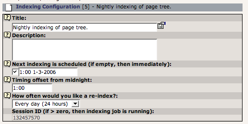

.. include:: /Includes.rst.txt

.. _about-indexing-configurations:

Generally about indexing configurations
^^^^^^^^^^^^^^^^^^^^^^^^^^^^^^^^^^^^^^^

Indexing configuration sets up indexing jobs that are performed by a
cron-script independently of frontend requests. The "crawler"
extension is used as a service to perform the execution of queue
entries that controls the indexing.

The Indexing configuration contains two parts

#. Definition of execution time and period.

#. Definition of indexing type and settings.

Below you see what all Indexing Configurations have in common:

   Common parameters in indexing configurations

These settings are described in the context sensitive help so please
refer to that for more information.

The "Session ID" requires a show introduction: When an indexing job is
started it will set this value to a unique number which is used as ID
for that process and all indexed entries are tagged with it. When the
processing of an indexing configuration is done it will be reset to
zero again.

The title of a configuration can be translated in order to ease usage
for backend users who use a different language than your default one.
Translation strings can be provided via TypoScript:

.. code-block:: typoscript

   plugin.tx_indexedsearch.settings._LOCAL_LANG {
      de.indexingConfigurations.13 = Mein Titel in Deutsch für Konfiguration 13
      de.indexingConfigurationHeader.13 = Alle Ergebnisse für Konfiguration 13
   }

