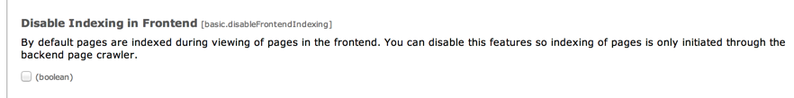

.. ==================================================
.. FOR YOUR INFORMATION
.. --------------------------------------------------
.. -*- coding: utf-8 -*- with BOM.

.. include:: ../../Includes.txt

.. _disable-frontend-indexing:

Disable frontend-initiated indexing
^^^^^^^^^^^^^^^^^^^^^^^^^^^^^^^^^^^

If you choose to index your site using Indexing Configurations you can
disable indexing through the user requests in the frontend. This is
easily done via the configuration of the Indexed Search extension in
the Extension Manager:

   Disabling the frontend indexing in the extension configuration

