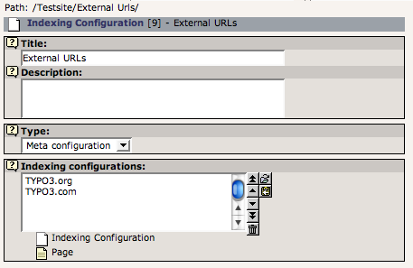
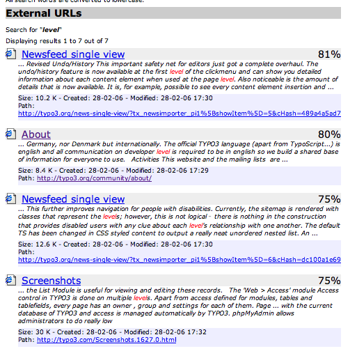

.. include:: /Includes.rst.txt

.. _grouping-indexing-configurations:

Grouping several indexing configurations in one search category
^^^^^^^^^^^^^^^^^^^^^^^^^^^^^^^^^^^^^^^^^^^^^^^^^^^^^^^^^^^^^^^

You might find that you want to group the results from multiple
indexing configurations in the same category. For instance, I have an
indexing configuration for "typo3.org" but I want
all search results to appear under the category "External URLs". This
can be done by creating a special type of indexing configuration which
only points to other indexing configurations:

   Grouping several indexing configurations

This indexing configuration is not used during indexing but during
searching. So a reconfiguration of the TypoScript to use uid 9 instead
of 7,8 will yield this result:

   Grouped search results

TypoScript:

.. code-block:: typoscript

   plugin.tx_indexedsearch.search.defaultFreeIndexUidList = 9,6,0

