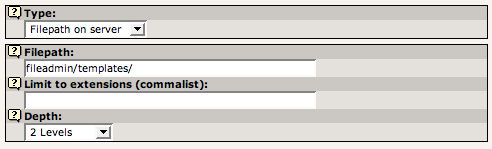
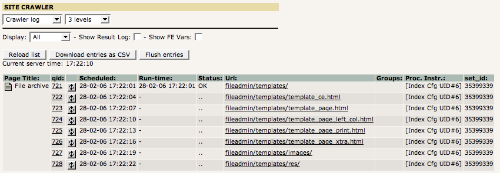
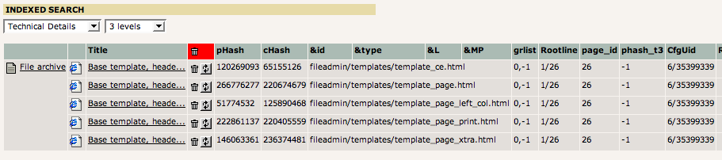

.. ==================================================
.. FOR YOUR INFORMATION
.. --------------------------------------------------
.. -*- coding: utf-8 -*- with BOM.

.. include:: ../../Includes.txt

.. _indexing-directories-of-files-filepath-on-server:

Indexing directories of files ("Filepath on server")
^^^^^^^^^^^^^^^^^^^^^^^^^^^^^^^^^^^^^^^^^^^^^^^^^^^^

You can also have directories of files on your server indexed
periodically, using the type "Filepath on server".

   Indexing configuration for a directory

Again, the options are either easy to understand or your can read more
about them in the Context Sensitive Help.

**Location:** The Indexed Search configuration should be located on a not-
in-menu page, just like the "External URL" type required. Same
reasons; results are bound to a page in the page tree.

The process of indexing a directory of files is the same as for the
external URL: For each directory a) all files are indexed and b) all
sub-directories added to the crawler queue for later processing. This
is shown in the crawler log:

   Crawler log entries for directories

When processing is done the result is shown in the Web > Info, "Indexed
search":

   Verifying the list of indexed directories

