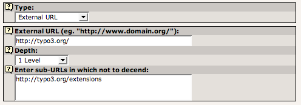
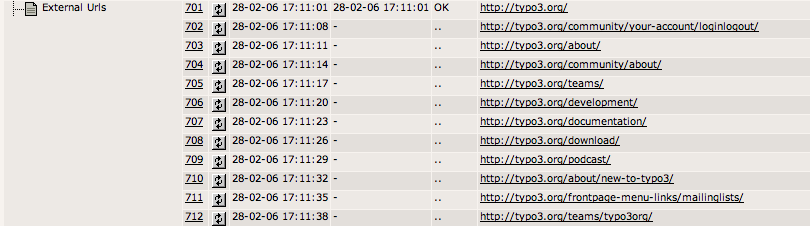
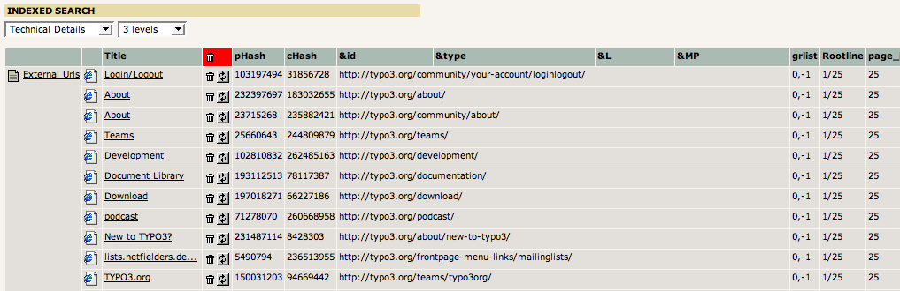

.. include:: /Includes.rst.txt

.. _indexing-external-websites:

Indexing External websites ("External URL")
^^^^^^^^^^^^^^^^^^^^^^^^^^^^^^^^^^^^^^^^^^^

You can index external websites using Indexing Configurations. They
can actually crawl an external URL! Configuration looks like this:

   Indexing configuration for an external URL

It pretty much explains itself how it works. The Context Sensitive
Help will provide enough information to complete configuration.

**Location:** You should place the Indexing Configuration on a "Not-
in-menu" page in the root of the site for instance. The page must be
"searchable" since the external URL results are bound to a page in the
page tree, namely the page where the configuration is found.

This is how the crawler log looks immediately after the crawling has
begun:

   Crawler log entries for an external URL

The initial entry is "http://typo3.org/" which is already processed.
When this process was executed it added entries for all found subpages
to the queue as well. When their execution time comes the crawler will
request those URLs as well and if subpages are found on them, entries
for those subpages are added until the configured depth is reached.

In Web > Info, "Indexed search" the indexed entries looks like this:

   Verifying the list of indexed external URLs

