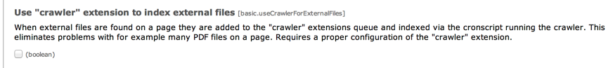

.. ==================================================
.. FOR YOUR INFORMATION
.. --------------------------------------------------
.. -*- coding: utf-8 -*- with BOM.

.. include:: ../../Includes.txt

.. _indexing-files-separately:

Indexing files on pages separately
^^^^^^^^^^^^^^^^^^^^^^^^^^^^^^^^^^

If enabled, links to local files found on pages will initiate indexing
of those external files. However, this often has the unpleasant effect
that too many files are indexed during the same page request. Using
the crawler extension you can configure the indexer to add a queue
entry instead of immediately indexing external files. Thus the
indexing will happen outside the frontend user request, using the
cronscript!

This behaviour is configured in the extension managers configuration
for "Indexed search":

   Setting the crawler to be used for linked files

