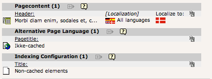
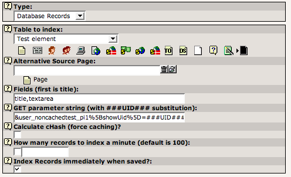
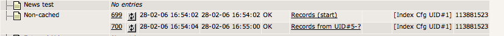
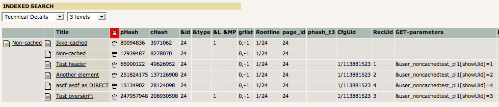

.. ==================================================
.. FOR YOUR INFORMATION
.. --------------------------------------------------
.. -*- coding: utf-8 -*- with BOM.

.. include:: ../../Includes.txt

.. _periodic-indexing-records:

Periodic indexing of records ("Database Records")
^^^^^^^^^^^^^^^^^^^^^^^^^^^^^^^^^^^^^^^^^^^^^^^^^

You can also use the Indexing Configuration to index single records.

**Location:** You must place the indexing configuration on the page
where you want the search results to be displayed - typically on the
page where a plugin exists that can process the parameters pointing to
the record. In the case below the Indexing Configuration is placed on
the same page as the frontend plugin ("Morbi diam enim...") that can
display the search results:

   Indexing configuration for records placed in the same page as the plugin

The configuration record looks like this:

   Indexing configuration for arbitrary records

If the records you want to index are not located on the page where the
indexing configuration and fronend plugin is, then you can point to
the location. Notice how the field with "GET parameters" is used to
define how the search results are shown - this must correspond with
what the plugin takes of parameters.

A fancy option is the "Index Records immediately when saved" - which
will index records as they are saved through "TCEmain"!

In the crawler log you will see the entries for record indexing like
this:

   Indexing configuration for arbitrary records

After processing the Web > Info, "Indexed search" view will show this
view:

   Verifying the indexed records

Notice how the GET parameters are nicely added and how the "CfgUid"
column contains the UID of the indexing configuration / the "set\_id"
of the processing.

In fact, if a record is removed its indexing entry will also be
removed upon next indexing - simply because the "set\_id" is used to
finally clear out old entries after a re-index!

