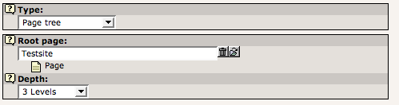
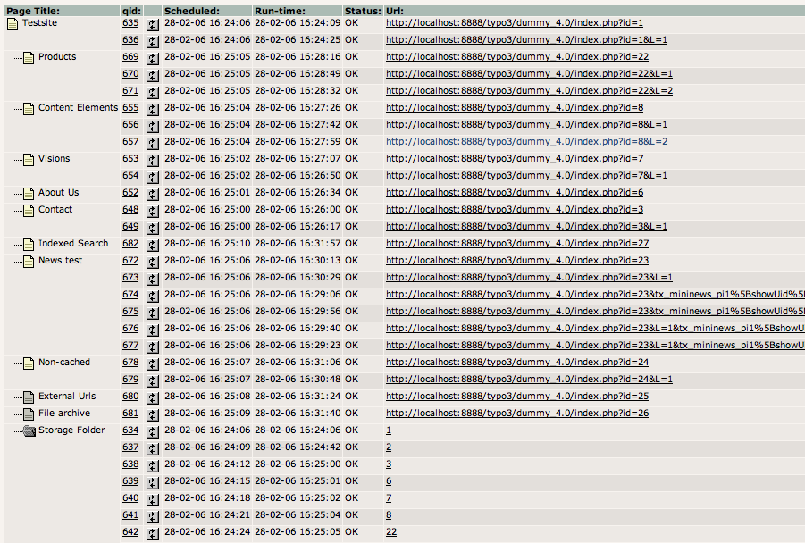
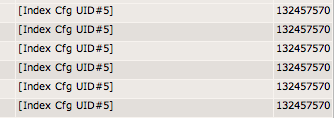
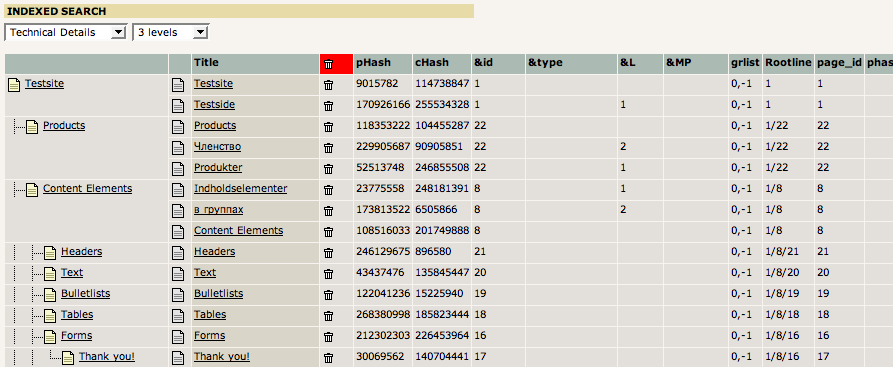

.. ==================================================
.. FOR YOUR INFORMATION
.. --------------------------------------------------
.. -*- coding: utf-8 -*- with BOM.

.. include:: ../../Includes.txt

.. _periodic-indexing-website:

Periodic indexing of the website ("Page tree")
^^^^^^^^^^^^^^^^^^^^^^^^^^^^^^^^^^^^^^^^^^^^^^

You can have the whole page tree indexed overnight using this indexing
configuration of type "Page tree":

   Settings in an indexing configuration for the full page tree

This defines that the page tree is to be crawled to a depth of 3
levels from the root point "Testsite". For each page a combination of
parameters is calculated based on the "crawler" configurations for the
"Re-index" processing instruction (See "crawler" extension for more
information) and those URLs are committed to the crawler log plus
entries for all subpages to the processed page (so that each of those
pages are indexed as well.)

This is what the crawler log may look like after processing:

   The crawler log after indexing the page tree

Here you can notice that the visited URLs have additional parameters
added - those are combined based on the "crawler" extensions
configuration in Page TSconfig.

Also notice the special crawler log entries found in the "Storage
folder". These are the "meta-entries" which calls an indexed search
hook which in turn generates the URL entries and pushed them to the
queue.

On the far right in this view you can see that noted as well,
including the "set\_id":

   Viewing the id of the indexing configuration in the crawler log

Finally, in the Web > Info, "Indexed search" you will see that these
visited URLs were re-indexed:

   Verifying the reindexing by the crawler

**Location:** Indexing configurations for indexing of the page tree
should be placed in a SysFolder since their location in the page tree
is not relevant to their function.

