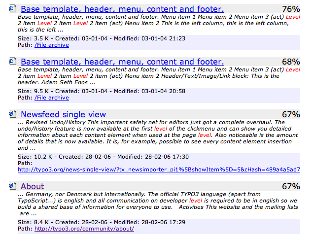
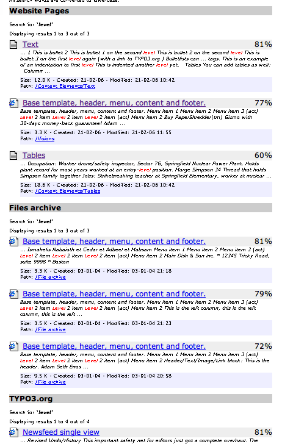
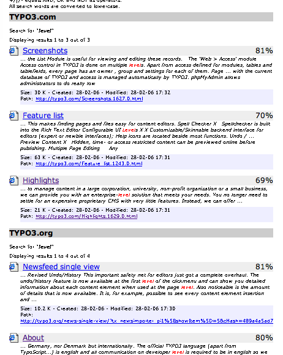
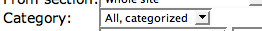

.. ==================================================
.. FOR YOUR INFORMATION
.. --------------------------------------------------
.. -*- coding: utf-8 -*- with BOM.

.. include:: ../../Includes.txt

.. _showing-search-results:

Showing the search results
^^^^^^^^^^^^^^^^^^^^^^^^^^

By default the search results are shown with no distinction between
those from local TYPO3 pages, records indexed, the file path and
external URLs. Only division follows that of the page on which the
result is found:

   Basic view of search results

However, you can configure to have a division of the search results
into categories following the indexing configurations:

   Categorized view of search results

To obtain this categorization you must set TypoScript configuration in
the Setup field like this:

.. code-block:: typoscript

   plugin.tx_indexedsearch.search.defaultFreeIndexUidList = 0,6,7,8
   plugin.tx_indexedsearch.blind.freeIndexUid = 0

The "defaultFreeIndexUidList" is uid numbers of indexing
configurations to show in the categorization! The order determines
which are shown in top. Changing it could bring results from typo3.org
in top:

   Categorized view of search results with a set order for categories

The categorization happens when the "Category" selector in the
"Advanced" search form is set like this:

   Choosing categorization in the advanced search form

(Notice, you can preset this value from TypoScript as well!)

.. _showing-search-results-specific:

Searching a specific category from URL
""""""""""""""""""""""""""""""""""""""

If you want search forms on the site to make look up directly in
results belonging to one or more indexing configurations you can use a
set or GET variables like these, here using UID values 7 and 8 since
they look up in typo3.org results:

::

   index.php?id=78&tx_indexedsearch[sword]=level&tx_indexedsearch[_freeIndexUid]=7,8

