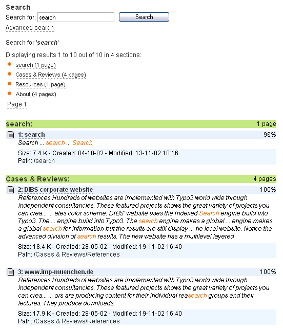
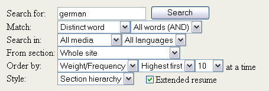

.. include:: /Includes.rst.txt

.. _introduction:

Introduction
------------

.. _what-does-it-do:

What does it do?
^^^^^^^^^^^^^^^^

The Indexed Search Engine provides two major elements to TYPO3:

#. **Indexing:** An indexing engine which indexes TYPO3 pages on-the-fly
   as they are rendered by TYPO3's frontend. Indexing a page means that
   all words from the page (or specifically defined areas on the page)
   are registered, counted, weighted and finally inserted into a database
   table of words. Then another table will be filled with relation
   records between the word table and the page. This is the basic idea.

#. **Searching:** A plugin you can insert on your website which allows
   website users to search for information on your website. By searching
   the plugin first looks in the word-table if the word exist and if it
   does all pages which has a relation to that word will be considered
   for the search result display. The search results are ordered based on
   factors like where on the page the word was found or the frequency of
   the word on the page.

This is an example of how the search interface on a website looks:

   Search results in the frontend

.. _features-of-the-indexer:

Features of the indexer
^^^^^^^^^^^^^^^^^^^^^^^

The indexing engine has several features:

- HTML data priority: 1) <title>-data 2) <meta-keywords>, 3) <meta-
  description>, 4) <body>

- Indexing external files: Text formats like html and txt and doc, pdf
  by external programs (catdoc / pdftotext)

- Wordcounting and frequency used to rate results

- Exact, partially or metaphone search

- Searching freely for sentences (non-indexed).

- NOT case-sensitive in any ways though.

.. _features-of-the-search-frontend-the-plugin:

Features of the search frontend (the plugin)
^^^^^^^^^^^^^^^^^^^^^^^^^^^^^^^^^^^^^^^^^^^^

The search interface has several options for advanced searching. Any
of those can be disabled and/or preset with default values:

- Searching whole word, part of word, sounds like, sentence

- Logical AND and OR search including syntactical recognition of AND, OR
  and NOT as logical keywords. Furthermore sentences encapsulated in
  quotes will be recognized.

- Searching can be targeted at specific media, for instance searching
  only indexed PDF files, HTML-files, Word-files, TYPO3-pages or
  everything

- The engine is language-sensitive based on the multiple-language
  feature of the TYPO3 CMS frontend.

- Searching can be performed in specific sections of the website.

- Results can be sorted descending or ascending and ordered by word
  frequency, weight, location relative to page top, page modification
  date, page title, etc.

- The display of search results can be intelligently divided into
  sections based on the internal page hierarchy. Thus results are
  primarily grouped by relation, then by hit-relevance.

This shows the full range of default options for "advanced search":

   All possible advanced search options

.. warning::

   The search frontend plugin is optimized for features, *not* speed.
   Especially it will be slow on a website with many pages in the page
   tree because it traverses the whole tree each time to build a list of
   accessible pages. However you can circumvent this by modifications to
   the search plugin so it does not check page access based on the id-
   list. But then you loose that feature of course. Can't have both.

   In any case; The indexing of pages and searching the indexed
   information are two different processes and therefore you can easily
   use another frontend plugin for making searches in the same data for
   whatever reason you might have for discarding the default search
   plugin.

