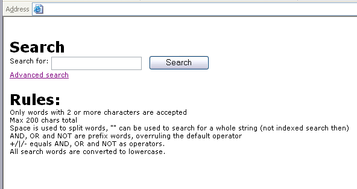

.. include:: /Includes.rst.txt

.. _user-manual:

User manual
-----------

.. _adding-search-plugin:

Adding the search plugin to a page
^^^^^^^^^^^^^^^^^^^^^^^^^^^^^^^^^^
#. Activate "indexed_search" in the Extensions Manager. You just need to activate it. It is already
   installed in non-composer mode. Make sure to require the package `typo3/cms-indexed-search` if
   you run the TYPO3 instance in composer mode.

#. Create a page called "Search" or something like that. This is where the search box will appear.

#. Create an extension template for this page that includes "Indexed Search (Extbase & Fluid)" or
   include it in your main template.

#. Create a new content element on that page and choose the type "General Plugin".

#. Then choose the "Selected plugin" to be "Indexed search":

.. figure:: ../Images/IndexedSearchPluginType.png
   :alt: Indexed Search plugin type

   Choosing "Indexed search" as a plugin type

That's it. Your frontend should now look like this:

   Default view in the frontend, search form and rules help text

The styles are most likely different from this, but that is controlled
by the developer having administration access to the system.

