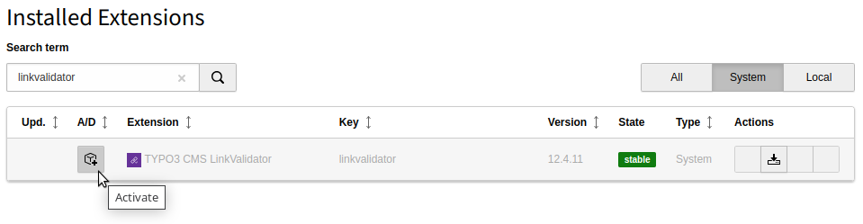

.. include:: /Includes.rst.txt

.. _administration:

Administration
--------------

The LinkValidator is a tool for checking link in user input. It is part of the
system extension :file:`linkvalidator`.

If you are using Composer, you can install it like any other (Core) extension
requiring the package `typo3/cms-linkvalidator`:

.. code-block:: bash

    composer require typo3/cms-linkvalidator

If you are using Composer and not working with the latest version of TYPO3
you will need to add a version constraint:

.. code-block:: bash

    composer require typo3/cms-linkvalidator:"^10.4"

If you want to use the LinkValidator in the Scheduler, the system extension
:file:`scheduler` also needs to be installed:

.. code-block:: bash

    composer require typo3/cms-scheduler

If you are not using Composer, you may have to activate the LinkValidator in
the Extension Manager.

   Activate the LinkValidator in the Extension Manager

LinkValidator uses the HTTP request library shipped with TYPO3.
Please have a look in the :ref:`Global Configuration <t3coreapi:typo3ConfVars>`,
particularly at the HTTP settings.

There, you may define a default timeout. Generally, it is recommended
to always specify timeouts when working with the LinkValidator.

