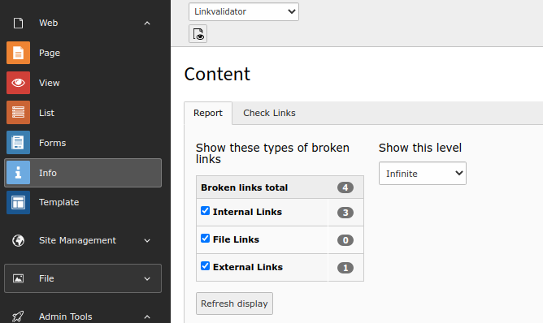
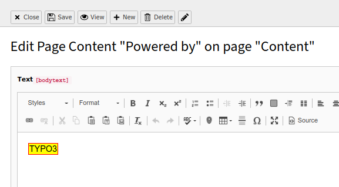

.. include:: /Includes.rst.txt

.. _editors:

==========================
Working with LinkValidator
==========================

This page handles how to work with LinkValidator as editor.
It is intended for a non-technical audience.

LinkValidator Report
====================

#. Access the module :guilabel:`Check Links`.
#. Select the page you want to work on in the page tree

   Access LinkValidator Report via "Check Links" module

You will now see the :guilabel:`Report` with the list of broken links.
In order to get results, select the checkboxes ("Internal Links",
etc.) and choose the appropriate depth under :guilabel:`Show this level`.
This will determine the page level, for example for depth :guilabel:`This page`,
LinkValidator will only show broken links for the page that is
currently selected in the page tree. The deeper you go, the more
broken links may possibly be shown. After you change the settings,
you must click :guilabel:`Refresh display`.

When you jump to a different page in the page tree, the :guilabel:`Report`
will be refreshed.

Listing of broken links
=======================

.. figure:: ../Images/ReportsTab.png
   :alt: LinkValidator Report with results

   LinkValidator Report with results

The list shows the following, from left to right:

#. **Element:** The title of the field which contains the broken link
#. **Path:** The title of the page and its parents
#. **Link:** The anchor text of the link
#. **URL / Link target:** The link target, where the link points to.
#. **Error message:** Information about the error. Often, this will be
   a 404 error, which means the link target simply does not exist.
#. **Last check:** When the broken link was detected
#. The pencil icon can be used to edit the field where the broken
   link exists.

You can now fix the broken links one after another, by clicking on
the pencil icon.

The corresponding form will open. The broken link will be marked
in a special style to make it visually stand out.

   Edit a field

You can now double-click on it to open the Link Browser and fix the
link. When you are done, click on save and close in order to
return to the :guilabel:`Report`.
