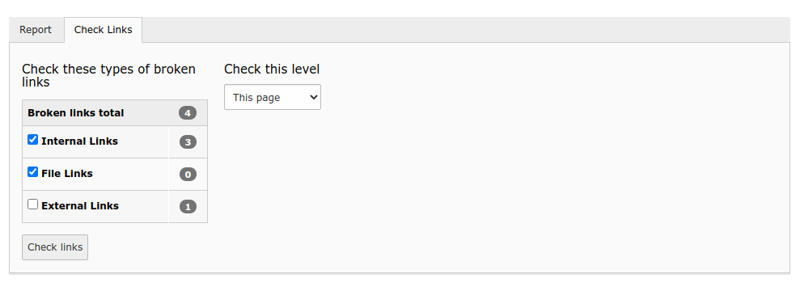
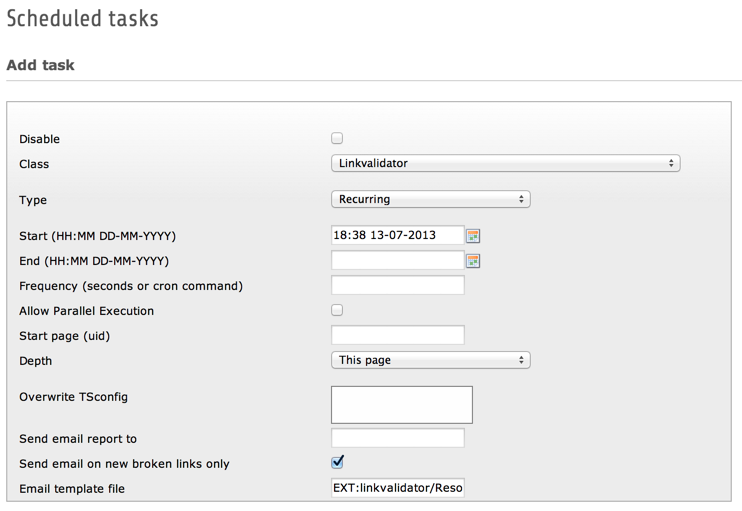

.. ==================================================
.. FOR YOUR INFORMATION
.. --------------------------------------------------
.. -*- coding: utf-8 -*- with BOM.

.. include:: ../Includes.txt

.. _introduction:

Introduction
------------

.. _about-this-document:

About this document
^^^^^^^^^^^^^^^^^^^

Linkvalidator is a system extension which enables you to conveniently
check your website for broken links. This manual explains how to
install and configure the extension for your needs.

.. _what-does-it-do:

What does it do?
^^^^^^^^^^^^^^^^

Linkvalidator checks the links in your website for validity, reports
broken links or missing files in your TYPO3 installation and provides
a way to conveniently fix these problems.

It includes the following features:

- Linkvalidator can check all kinds of links. This includes internal
  links to pages and content elements, file links to files in the local
  file system and external links to files somewhere else in the web.

- Linkvalidator by default looks into header fields and bodytext fields.
  It can be configured to check any field you like.

- Linkvalidator offers a just in time check of your website.
  Additionally the TYPO3 scheduler is fully supported to run checks
  automatically. In this case you can choose, if you want to receive an
  email report, if broken links were found.

- Linkvalidator is extendable. It provides hooks to check special types
  of links like those from the extension "linkhandler". The possibility
  to check these already is built in.

.. _screenshots:

Screenshots
^^^^^^^^^^^

This is the linkvalidator backend module. It is located inside the
info module and by default provides two tabs: "Report" and "Check
Links". The Report tab is always shown first. Here you can view the
broken links which were found, when your website was last checked.

.. figure:: ../Images/ReportsTab.png
   :alt: The Reports tab

   Viewing broken links in the Reports tab

The Check Links tab is used to check links on demand and can be hidden
with TSconfig, if desired.

   Checking links live in the TYPO3 BE

The workflow in the module is the following:

- First you set the depth of pages you want to consider when checking
  for broken links in the Check Links tab. Then click the Check links
  button.

- Once the checks are done, the module automatically switches to the
  Report tab where the results are displayed.

- The type and ID of the content containing the broken link become
  visible when you move the mouse over the icon for the content type.
  The pencil icons at the beginning of each row enable you to quickly
  fix the displayed elements.

Linkvalidator features full support of the TYPO3 scheduler. This is
the linkvalidator task:

   Defining the linkvalidator task in the Scheduler

- With this task you can run linkvalidator regularly via cron without
  having to manually update the stored information on broken links.

- You can e.g. overwrite the TSconfig configuration. Without any change,
  the linkvalidator settings which apply for the respective pages will
  be used. If you set values there, the former will be overwritten.

- The linkvalidator task can send you a status report via email. You can
  create an own email template as needed. The default template is
  located in typo3/sysext/linkvalidator/res/mailtemplate.html.

.. _credits:

Credits
^^^^^^^

This extension is particularly based on the extension
"cag\_linkchecker", which was originally developed for Connecta AG,
Wiesbaden. cag\_linkchecker is maintained by Jochen Rieger and Dimitri
König.

.. _feedback:

Feedback
^^^^^^^^

If you find a bug in this manual or in the extension in general,
please file an issue in the bug tracker of this extension:
`http://forge.typo3.org/projects/extension-linkvalidator/issues
<http://forge.typo3.org/projects/extension-linkvalidator/issues>`_

