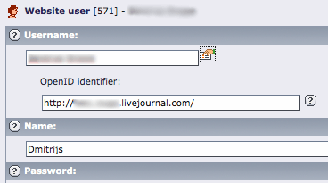
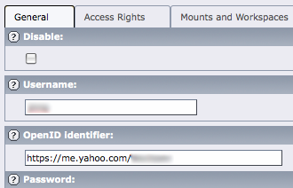

.. ==================================================
.. FOR YOUR INFORMATION
.. --------------------------------------------------
.. -*- coding: utf-8 -*- with BOM.

.. include:: ../Includes.txt

.. _configuration:

Configuration
-------------

Frontend and Backend users can login using OpenID only and only if
they have OpenID configured in their records. Frontend users have
OpenID field as a secondary option (palette) to the regular user
identifier:

   Setting the OpenID identifier for a frontend user

Backend users have their OpenID below the regular user identifier:

   Setting the OpenID identifier for a backend user

User identifiers must follow certain rules.

Identifiers for Backend users must be unique in the whole database. If
identifier is not unique, TYPO3 will silently add a number to the
newly added OpenID thus ensuring that only one user has that OpenID.
The duplicate OpenID will become invalid.

Identifiers for Frontend users are unique within page. Two users on
the same page may not have the same OpenID. But two users on different
pages can have the same OpenID.

