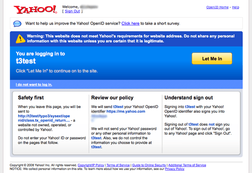

.. ==================================================
.. FOR YOUR INFORMATION
.. --------------------------------------------------
.. -*- coding: utf-8 -*- with BOM.

.. include:: ../Includes.txt

.. _introduction:

Introduction
------------

.. _what-does-it-do:

What does it do?
^^^^^^^^^^^^^^^^

This extension provides OpenID authentication for the Frontend and
Backend. OpenID allows to authenticate on many web sites using a
single registration at the OpenID provider. There are several OpenID
providers on the Internet. Such major companies and sites as AOL,
Blogger, Flickr, LiveJournal, Technoratti and Yahoo provide OpenID
services (the full list can be found `here <http://openid.net/get/>`_
). Once registered with one OpenID provider, user can use his OpenID
on any OpenID–enabled web site.

.. _screenshots:

Screenshots
^^^^^^^^^^^

TYPO3 uses the same login forms for standard and OpenID
authentication. When user enters his OpenID, he is transferred to the
OpenID provider web site, where he should confirm his intention to
authenticate with TYPO3 web site. OpenID provider can ask for the
password. After conforming user is transferred back to the TYPO3 web
site. Here is how Yahoo OpenID screen looks like:

   OpenID authentication via Yahoo!

This screenshot was taken on the developer's computer. Here Yahoo
warns that the site possibly is not trustworthy.

