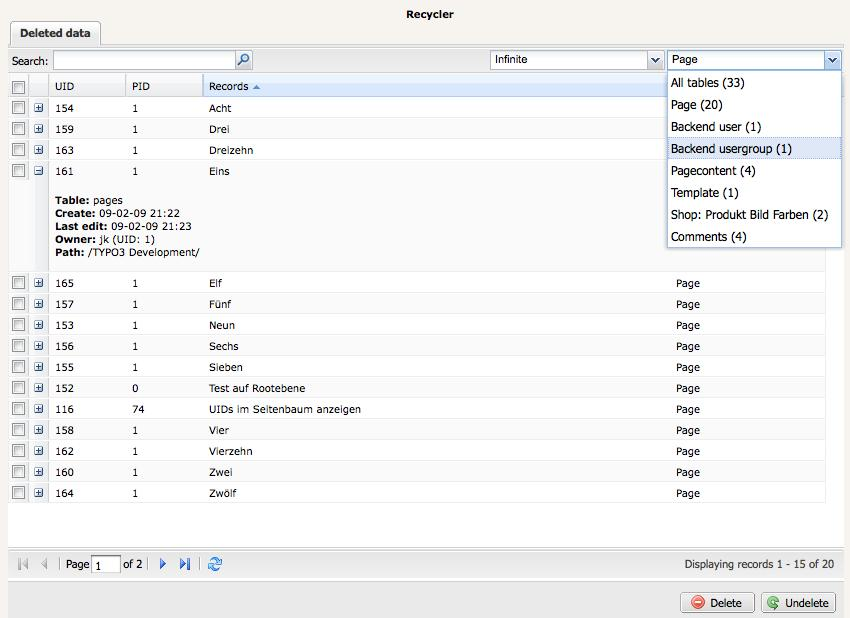

.. ==================================================
.. FOR YOUR INFORMATION
.. --------------------------------------------------
.. -*- coding: utf-8 -*- with BOM.

.. include:: ../Includes.txt

.. _introduction:

Introduction
------------

.. _what-does-it-do:

What does it do?
^^^^^^^^^^^^^^^^

The new improved recycler offers the possibilities of cleaning up the
garbage collection or to restore data again. Based on an JavaScript
interface it's possible to get a quick overview of the accordant
records, filter the resultset and execute the required actions.

.. _screenshots:

Screenshots
^^^^^^^^^^^

   A view of the Recycler's main screen

.. _credits:

Credits
^^^^^^^

This feature is originally based on the kj\_recycler extension,
developed by Julian Kleinhans.
