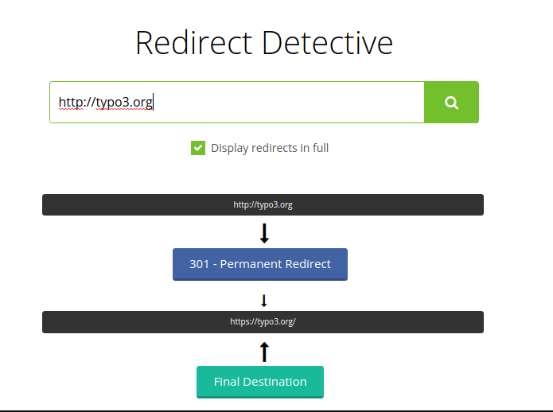

.. include:: /Includes.rst.txt

.. _best-practices:

==============
Best practices
==============

Here are some general tips for managing redirects:

-   Check for conflicts regularly with
    :ref:`redirects:checkintegrity <redirects-checkintegrity>`. This is no
    longer as much an issue as with previous versions, because it was resolved
    with `patch 68202 <https://review.typo3.org/c/Packages/TYPO3.CMS/+/68202>`__.
    Since this patch, a path is no longer used for the target. A redirect is
    constructed using the page ID, e.g.  `t3://page?uid=1` as target. This means
    the redirect will still work, even if the slug changes again. This way, it
    is less likely that :ref:`redirect loops <redirect-loop>` and
    :ref:`redirect chains <redirect-chain>` are created because the redirect
    always redirects directly to the target page.
-   Check number of redirects and regularly clean out unnecessary redirects,
    e.g. with :ref:`redirects:cleanup <redirects-cleanup>`. If you use the
    :ref:`hit counter <hit-counter>`, be aware that it comes with a small
    performance impact.
-   :ref:`"Redirect chains" <redirect-chain>` are not as much a problem, but can
    become inefficient. A "redirect chain" are several redirects which must be
    followed until the destination is reached. Ideally, these should be merged.

.. _best-practices-editors:

Editors
=======

Well curated content and editors which have a good understanding of SEO and
possible problems with redirects are a good idea in any case. TYPO3 comes
with extensive :ref:`permission <t3coreapi:access-users-groups>` and
:doc:`workspaces <ext_workspaces:Index>` management - which gives you the
possibility to only grant advanced editor groups access to parts of the content
(e.g. pages, redirect module) which they are well equipped to handle.

-   If you give editors access to the redirects module, make sure that they
    understand the usage and for example do not create
    :ref:`redirect loops <redirect-loop>`.
-   Often changing slugs comes with a cost. Redirects are a counter measure
    so that pages with changing slugs are still accessible but a better
    strategy is to only change slugs when absolutely necessary.

.. _best-practices-performance:

Performance
===========

With a certain number of redirects and depending on your setup, performance
problems *may* occur through technical limitations.

The following rules of thumb should be followed:

-   Restrict time-to-live [`ttl`] of redirects - manual and automatically
    created.
-   Cleanup regularly and remove outdated redirects.
-   Recheck redirects and aggregate them on a manual basis to lower the number.
-   Keep the number of redirects for the whole instance in a certain range.
-   Instruct editors to be careful with slug changes and thus creating redirects
    automatically, which may be unnecessary.

.. note::

    Handling redirects through PHP applications has technical limitations,
    even more if complex redirects like regexp-style redirects should be
    supported. Thus, handling redirects with EXT:redirects is only suitable for
    installations with a certain number of redirects.

    It is recommended to monitor performance and - if necessary - export
    redirects to your webserver configuration or load balancer.

Troubleshooting tools
=====================

Since redirects are resolved in the web browser, it may be difficult to
troubleshoot. There are many tools available, for example you can
use a command line tool like `curl` to follow and show redirects or use the
online tool `Redirect detective <https://redirectdetective.com/>`__.
Redirect detective also detects redirect loops.

    Output of Redirect Detective for `http://typo3.org`.

Example: Resolve redirects with curl (`-L` follows redirects):

.. code-block:: shell

    curl -I -L -s -X GET http://example.org

Output:

.. code-block:: shell

    HTTP/1.1 301 Moved Permanently
    ...
    Location: http://example.com
    ....

    HTTP/1.1 301 Moved Permanently
    ...
    Location: https://example.com
    ....

    HTTP/1.1 200 OK
    ...

As you can see, `http://example.org` is redirected twice, first to
`http://example.com` and then to the HTTPS variant.

.. note::

    These are just two simple tools of many you can use.
