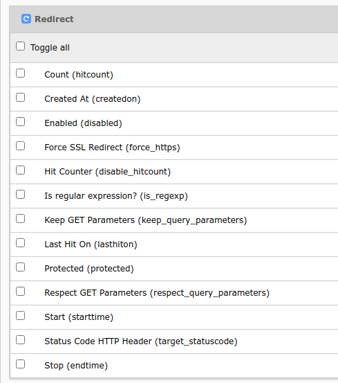
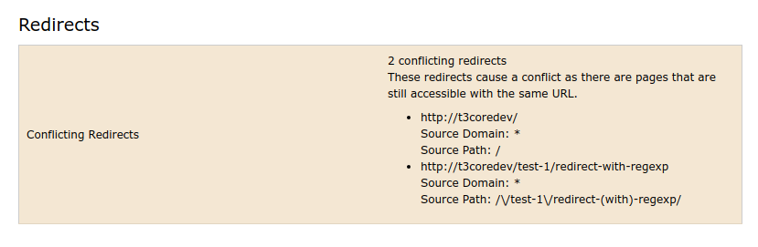

.. include:: /Includes.rst.txt

=====
Setup
=====

The redirects extension requires no extra configuration once it is installed.
However, it is recommended to familiarize yourself with
the settings and commands outlined in this page. Depending on your site and how
editing is handled, changes in the configuration and regular maintenance may be
required.

.. _site-configuration:

Site configuration
==================

The core comes with the following site settings for redirects which can be
adjusted in the file :file:`config/sites/<site>/config.yaml` for
each site.

.. hint::

    In non Composer installations, the file is found in
    :file:`typo3conf/sites/<site>/config.yaml`.

The following settings apply to **automatically created redirects**.

TYPO3 comes with working defaults. It is not necessary to add the settings
section if you use the defaults.

.. code-block:: yaml

   settings:
      redirects:
        # Automatically update slugs of all sub pages
        # (default: true)
        autoUpdateSlugs: true
        # Automatically create redirects for pages with a new slug (works only in LIVE workspace)
        # (default: true)
        autoCreateRedirects: true
        # Time To Live in days for redirect records to be created - `0` disables TTL, no expiration
        # (default: 0)
        redirectTTL: 30
        # HTTP status code for automatically created redirects, see
        # https://developer.mozilla.org/en-US/docs/Web/HTTP/Redirections#Temporary_redirections
        # (default: 307)
        httpStatusCode: 307

The `httpStatusCode` does not affect the default status code for manually created
redirects. This can be adjusted via TCA
:php:`$GLOBALS['TCA']['sys_redirect']['columns']['target_statuscode']['config']['default']`.

.. seealso::

    The `settings` in the site configuration are generally explained in
    "TYPO3 Explained" > :ref:`t3coreapi:sitehandling-settings`.

Console commands
================

As for commands in general, it is possible to execute them via the command
line or via the TYPO3 scheduler in the backend.
Please see the general information about this in "TYPO3 Explained" >
:ref:`t3coreapi:symfony-console-commands-cli`.

We explain executing the commands from the command line here, it is recommended
to automate regular execution, e.g. via cron.

.. _redirects-cleanup:

redirects:cleanup
-----------------

The CLI command `redirects:cleanup` can be used to periodically cleanup existing
redirects under given conditions.

Use `-h` to see all options:

.. code-block:: shell

    vendor/bin/typo3 redirects:cleanup -h

**Example 1:** Remove all redirects with less than 50 hits **and** older than 30
days.

.. code-block:: shell

    vendor/bin/typo3 redirects:cleanup -c 50 -a 30

.. hint::

    The `-c` option does nothing if the
    :ref:`hitcounter feature toggle <hit-counter>` is not enabled. Be careful
    when using the `-c` (= `--hitCount`) option. It is advised to combine it with
    `-a`, otherwise this will also cleanup redirects which were just created and
    did not have the possibility to accumulate any hits.

**Example 2:** Clean all redirects for domains foo.com and bar.com older than 90 days
and with hit counter less than 100 which start with the source path `/foo/bar`
and have a status code of 302 or 303.

.. code-block:: shell

    vendor/bin/typo3 redirects:cleanup --domain foo.com --domain bar.com \
    --age 90 --hitCount 100 --path "/foo/bar%" --statusCode 302 --statusCode 303

.. _redirects-checkintegrity:

redirects:checkintegrity
------------------------

The checkintegrity command checks existing redirects for conflicts. A typical
conflict may be a :ref:`redirect loop <redirect-loop>`. In this case the source
and target point to the same page or the redirect loop affects a number of
redirects, each redirecting to the next and looping back to the first, e.g.
`/a => b, /b => /a`.

.. warning::

    Currently, there are known problems where the checkintegrity command
    may report false positives. This can happen if additional routing enhancers
    / decorators are in place.

Example usage to check all sites:

.. code-block:: shell

    vendor/bin/typo3 redirects:checkintegrity

Check only the site mysite:

.. code-block:: shell

    vendor/bin/typo3 redirects:checkintegrity mysite

This will output one line per redirect conflict. The output may look like
this:

.. code-block:: none

    Redirect (Host: *, Path: /test-1) conflicts with http://mysite/test-1

You can now search for the affected redirects in the redirects module, e.g.
by filtering with *Source Path* `/test-1`.

.. _editor-permission:

Configure editor permission
===========================

By default, editors (without admin privileges) cannot access redirects directly and they cannot
revert automatic redirects. This can be problematic, because the notification
with the option to revert redirects and the notification that they were reverted
appears regardless, even if an editor does not have access and the redirects
are not reverted.

In order to make **reverting redirects** possible for non-admin backend users,
configure this in the backend group :guilabel:`Access Lists` tab:

-   Activate :guilabel:`Redirect [sys_redirect]` in :guilabel:`Tables (listing)`
-   Activate :guilabel:`Redirect [sys_redirect]` in :guilabel:`Tables (modify)`

In order to give editors full access to the **redirects module**, give them
access to the :sql:`sys_redirect` table as outlined above and configure this in
the backend group :guilabel:`Access Lists` tab:

-   Activate :guilabel:`Site Management>Redirects [site_redirects]` in
    :guilabel:`Modules`.

.. warning::

    It is recommended to only give trusted and experienced backend users access
    to the redirects module because they will have access to all redirects for
    the entire installation and may unintentionally wreak havoc on the site.

    Especially problematic can be redirect loops because they result in
    broken pages, but these can be detected, using :ref:`redirects:checkintegrity
    <redirects-checkintegrity>`.

By default the fields *Source Domain*, *Source Path* and *Target* are enabled,
the rest are excluded fields, which must be enabled for the respective backend user
group in the :guilabel:`Access Lists` tab > :guilabel:`Allowed excludefields` >
:guilabel:`Redirect`.

    Allowed excludefields

.. _hit-counter:

Hit counter
===========

The hit counter can be activated via
:ref:`Feature Toggle <t3coreapi:feature-toggles>`, either in the backend in
:guilabel:`Settings` > :guilabel:`Feature Toggles` >
:guilabel:`Redirects: hit count` or in the
configuration file :file:`LocalConfiguration.php` or
:file:`AdditionalConfiguration.php`.

.. code-block:: php

    'SYS' => [
            'features' => [
                    'redirects.hitCount' => true
            ],
    ],

This feature toggle is disabled by default, because it comes with a small performance
impact that requires additional SQL :sql:`UPDATE` queries.

Every time a page is accessed the hit counter will be incremented. Based on the
hit counter, a delete policy for unnecessary redirects can be defined.

Visit the :ref:`redirects:cleanup <redirects-cleanup>` with the option
`-c` for more information.

System reports
==============

The redirect conflicts will also be shown in the system report, available
via :guilabel:`Reports` > :guilabel:`Status Report` in the TYPO3 backend.

It is required to run `redirects:checkintegrity` regularly, so that the results
can be displayed in the report.
The information is stored in the registry (:sql:`sys_registry` table in the
database).

    Redirect conflicts in system report
