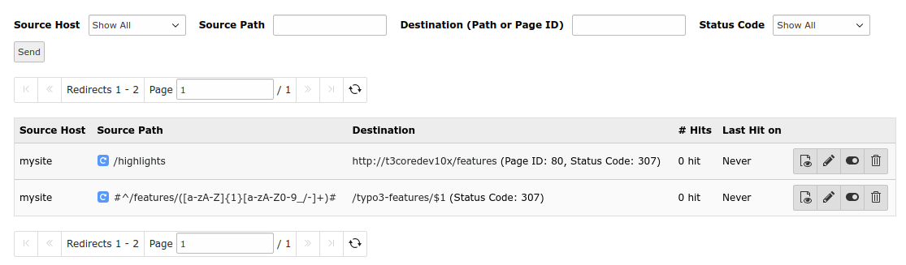
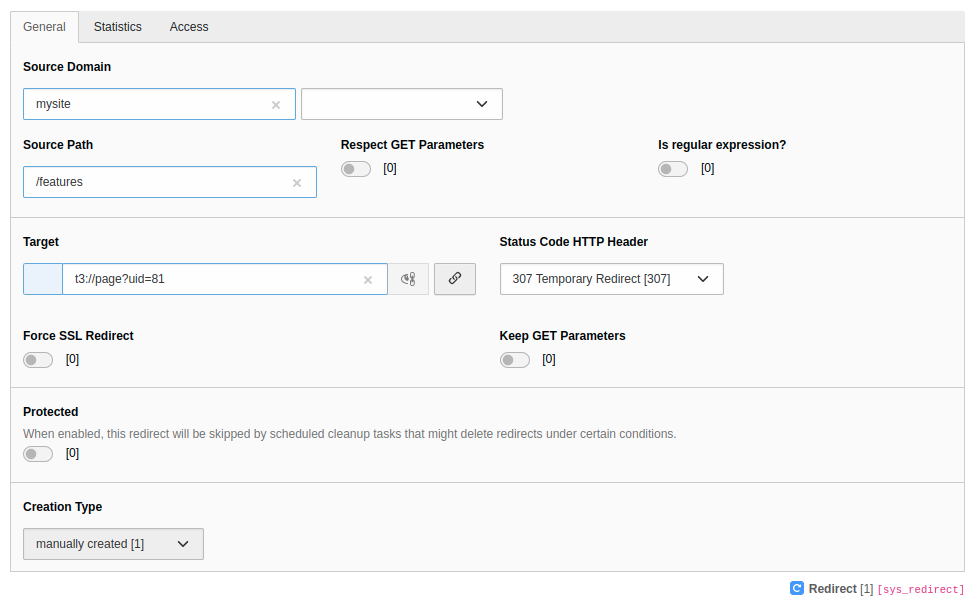
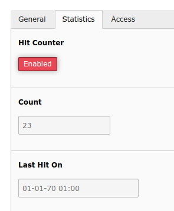
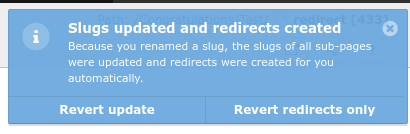
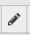
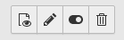

.. include:: /Includes.rst.txt

=====
Usage
=====

Redirects module
================

Access the redirects module in the TYPO3 backend under :guilabel:`Site Management`
> :guilabel:`Redirects`.

.. figure:: ../Images/RedirectsMenu.png
    :class: with-shadow

    Open Redirects module

List
----

    Redirect list

You will see a list of the existing redirects with the following columns labels.

#.  **Source Domain**
#.  **Source Path**
#.  **Target**
#.  **Count**: Number of "hits" (only if hit counter is on)
#.  **Last Hit on**: When was the most recent redirect "hit"  (only if hit
    counter is on)
#.  *Action buttons*: View page, edit, disable and delete |action_buttons_image|

.. tip::

    Hover over the text to see the link markup (underline) and a tooltip.

It is also possible to **sort** by clicking on the :guilabel:`Source Host` or
:guilabel:`Source Path` column headers and changing the sort order by clicking
again, as also done elsewhere in the backend.

By clicking on the *Source Path* of one of the columns or on the pencil edit
icon |edit_action_image|, you can **edit** the record. Clicking on a link in the
*Destination* column, should open the link target.

The :guilabel:`+` sign on the top will open an edit form to create a **new
redirect**.

It is also possible to **filter**, e.g. by the *Source Path*,
*Status Code* or only show redirect records which were "*Never hit*"
(see Information on :ref:`Hit counter <hit-counter>` which must be explicitly
enabled via Feature Toggle).

Edit form
---------

When creating a new redirect or editing an existing one, the edit form will open.

A redirect generally consists of these 2 parts which are separated in the
edit form:

#.  A **source** part (host, path, query parameters) which is matched against
    the URL. If it matches, the redirect is applied
#.  A **target** part which defines where the redirect should redirect to and
    some additional parameters like the HTTP status code, whether to force HTTPS
    and keep query parameters

Also, the redirect has some additional parameters that are specific for the
redirect record but not relevant when generating the redirect, such as the
:guilabel:`Protected` field.

Admin users will see the respective database fields from the table
:sql:`sys_redirect` in square brackets (e.g.
:guilabel:`Source Domain [source_host]`) next to the label if in debug mode.

Non-admin users may not see all the fields. By default *Source Domain*, *Source Path*
and *Target* are enabled, the rest are exclude fields and must be enabled in the
backend group permissions, see
:ref:`backend user configuration <editor-permission>`.

General tab
~~~~~~~~~~~

    Edit redirect

----

**Source:**

.. confval:: Source Domain

    :Field: source_host

    It is possible to select one of the domains from the site configuration or
    use the wildcard (`*`). In this case the redirect applies to all sites!

.. confval:: Source Path

    :Field: source_path

    Can be an actual path, e.g. `/path`. For URLs with different entry points
    for languages, you should use the full path, e.g. `/en/path`.
    :ref:`Regular expressions <regex-examples>` are  possible, but then
    `is_regexp` must be enabled. Regular expressions must be enclosed in
    delimiters, e.g. `#^/path/([a-zA-Z]{1}[a-zA-Z0-9_/-]+)#` or
    `/^\/path\/([a-zA-Z]{1}[a-zA-Z0-9_/-]+)/`.

.. confval:: Respect GET Parameters

    :Field: respect_query_parameters

    If on, matching is also performed on query parameters. If off, matching is
    only performed on the path.

.. confval:: Is regular expression?

    :Field: is_regexp

    Evaluate the Source Path as regular expression.

----

**Target:**

.. confval:: Target

    :Field: target

    The redirect target, can be a

    - path, e.g. `/features`
    - URL, e.g. `https://example.org/features`
    - page ID or page URI, e.g. `t3://page?uid=1`
    - file URI, e.g. `t3://file?uid=1`

.. confval:: Status Code HTTP Header

    :Field: target_statuscode

    The :ref:`HTTP status code <http-status-codes>` that will be sent to the
    client. This is 307 (Temporary Redirect) by default.

.. confval:: Force SSL Redirect

    :Field: force_https

    When redirecting, use HTTPS when constructing the target URL. This will even
    be the case, if a full URL is given as target (e.g.
    `http://example.com/features`) or if the entry point of a site uses HTTP, so
    make sure your site supports HTTPS (which is recommended anyway).

.. confval:: Keep GET Parameters

    :Field: keep_query_parameters

    When redirecting, add query parameters of original URL (with possible
    changes) to the target. By default, the query parameters are omitted, so
    source URL `https://example.com/features?abc=1` would be redirected to
    `https://example.com/all-features`. If there are already query
    parameters in the target field, these are used instead.

----

.. confval:: Protected

    :Field: protected

    This does not affect the redirect itself. It protects the record from
    automatic deletion (e.g. with redirects:cleanup).

Statistics tab
~~~~~~~~~~~~~~

    Statistics tab with hit counter

This tab is only available, if the hit counter is enabled. Here you can disable
the hit counter for a specific redirect and also see read-only statistics.

.. confval:: Hit Counter

    :Field: disable_hitcount

    Disable the hit counter only for this redirect.

.. confval:: Count

    :Field: hitcount
    :Editable: read only

    Number of hits for this particular redirect. (How often was the page
    accessed which triggered this redirect?)

.. confval:: Last Hit on

    :Field: lasthiton
    :Editable: read only

    When was the last hit on this redirect?

.. confval:: Created At

    :Field: createdon
    :Editable: read only

    When was this redirect created?

Access tab
~~~~~~~~~~

.. confval:: Enabled

    :Field: disabled

    If disabled, the redirect has no effect.

.. confval:: Start

    :Field: starttime

    If this is not empty, "now" (current time) must be after Start time for the
    redirect to have effect.

.. confval:: Stop

    :Field: endtime

    If this is not empty, "now" (current time) must be before Stop time for the
    redirect to have effect.

.. _regex-examples:

Regex examples
--------------

Example 1: Source path with regular expression and capturing group.

redirect

+-----------------------------------------+-----------------------+----------------------------+
| Source Path                             | Is Regular Expression | target                     |
+-----------------------------------------+-----------------------+----------------------------+
| `#^/path/([a-zA-Z]{1}[a-zA-Z0-9_/-]+)#` | true                  | https://mysite/newpath/$1  |
+-----------------------------------------+-----------------------+----------------------------+

with the following result:

+-------------------------------+----------------------------------+
| URL                           | result URL                       |
+-------------------------------+----------------------------------+
| https://mysite/path/something | https://mysite/newpath/something |
+-------------------------------+----------------------------------+

.. important::

    TYPO3 will not syntax check the redirect. Make sure you enter working
    redirects enclosed in delimiters. Use tools like https://regex101.com/,
    if necessary.

Automatic redirects creation
============================

Redirects are created automatically on slug changes, if EXT:redirects is
installed and automatic creation is enabled in
:ref:`site configuration <site-configuration>`.

A redirect from the old URL to the new URL will be created. All sub pages are
checked too and the slugs will be updated and redirects will be created for
these as well.

After the creation of the redirects a notification will be shown to the user.

    Revert redirect

The notification contains two possible actions:

- revert the complete slug update and remove the redirects
- or only remove the redirects

.. note::

    No redirects are generated for workspace versions in the TYPO3 backend.
    The setting `redirect.autoCreateRedirects` is internally disabled in this
    case.

