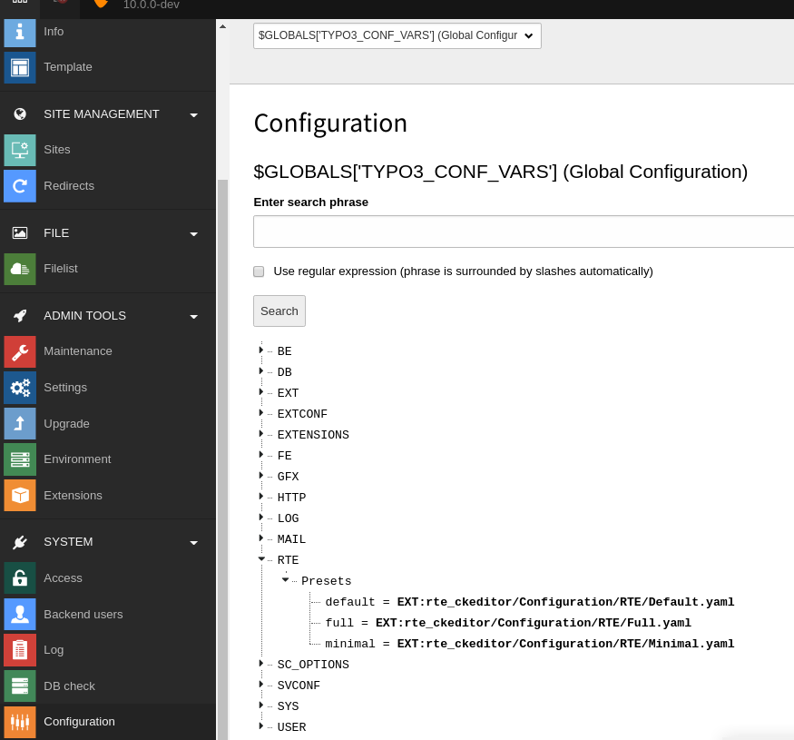
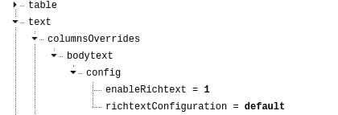

..  include:: /Includes.rst.txt
..  highlight:: typoscript

..  _config-typo3:

==========================
TYPO3 Configuration Basics
==========================

Just in case you are not familiar with how to configure TYPO3, we will
give you a very brief introduction. Otherwise, you can safely
skip this part and continue reading
:ref:`config-concepts`.

We only cover configuration methods that are used to configure `rte_ckeditor`.

..  _config-typo3-page-tsconfig:

Page TSconfig
=============

We recommend you to put all configurations for the preset in the
:ref:`YAML <config-typo3-yaml>` configuration. However, it is still possible to
override these settings through the page TSconfig.

You can find a list of configuration properties in the :ref:`Page TSconfig
reference, chapter RTE <t3tsref:pageTsRte>`.

Relevant Settings for `rte_ckeditor`
------------------------------------

Page TSconfig can be used to change:

#.  Default preset:

    ..  code-block:: tsconfig

        RTE.default.preset = full

#.  Override for one field (:typoscript:`RTE.config.[tableName].[fieldName].preset`):

    ..  code-block:: tsconfig

        RTE.config.tt_content.bodytext.preset = myCustomPreset
        RTE.config.tx_news_domain_model_news.bodytext.preset = minimal

#.  Override for one field defined in flexform (:typoscript:`RTE.config.[tableName].[flexForm\.field\.name].preset`):

    ..  code-block:: tsconfig

        RTE.config.tt_content.settings\.notifications\.emailText.preset = myCustomPreset

#.  Override for one field, if type matches (:typoscript:`RTE.config.[tableName].[fieldName].types.[type].preset`):

    ..  code-block:: tsconfig

        RTE.config.tt_content.bodytext.types.textmedia.preset = minimal

How to change values
--------------------

See the :ref:`Page TSconfig reference,
chapter Setting Page TSconfig <t3tsref:setting-page-tsconfig>`. This chapter
also expains how to verify the settings.

..  _config-typo3-global-configuration:

Global Configuration
====================

Global Configuration is a system-wide general configuration.

Relevant Settings for `rte_ckeditor`
------------------------------------

The setting :php:`$GLOBALS['TYPO3_CONF_VARS']['RTE']['Presets']` is used to configure
the available presets for rich text editing.

By default, the presets "minimal", "default" and "full" are defined.

If you add a new preset, you must add it to this array.

How to change values
--------------------

Usually, Global Configuration can be configured in the backend in
:guilabel:`Admin Tools > Settings > Configure Installation-Wide Options`.

However, the settings relevant for rich text editing, :php:`$GLOBALS['TYPO3_CONF_VARS']['RTE']['Presets']`
cannot be configured in the backend.

You must either configure this in:

#.  The file :file:`%config-dir%/system/additional.php`
#.  Or in an extension in the file :file:`EXT:<extkey>/ext_localconf.php`

..  code-block:: php

    if (empty($GLOBALS['TYPO3_CONF_VARS']['RTE']['Presets']['myCustomPreset'])) {
        $GLOBALS['TYPO3_CONF_VARS']['RTE']['Presets']['myCustomPreset']
            = 'EXT:<extkey>/Configuration/RTE/MyCustomPreset.yaml';
    }

How to view settings
--------------------

You can view the Global Configuration in
:guilabel:`System > Configuration > $GLOBAL['TYPO3_CONF_VARS'] (Global Configuration) > RTE`.

    Global Configuration: RTE > Presets

..  _config-typo3-yaml:

YAML
====

Most of the configuration of `rte_ckeditor` will be done in a YAML file.

Relevant Settings for `rte_ckeditor`
------------------------------------

See :ref:`config-ref`

How to change values
--------------------

This is done directly in the file. The YAML file should be included in a
sitepackage extension, see :ref:`best-practice-sitepackage`.

..  _config-typo3-tca:

CKEditor related TCA configuration
==================================

The :abbr:`table configuration array (TCA)` is used to configure database fields and how they will behave in the
backend when edited. It is for example used to define that ``tt_content.bodytext`` should be edited
with a rich text editor.

Relevant Settings for `rte_ckeditor`
------------------------------------

*   :ref:`t3tca:confval-text-enablerichtext`
*   :ref:`t3tca:confval-text-richtextConfiguration`

How to change values
--------------------

This must be done in an extension in :file:`Configuration/TCA`. Usually this is done within a custom sitepackage
extension, see :ref:`best-practice-sitepackage`.

How to view settings
--------------------

You can view TCA in the backend:
:guilabel:`System > Configuration > $GLOBAL['TCA'] (Table configuration array)`.

For example, look at :guilabel:`tt_content > columns > bodytext`.

However, you will
find that neither `enableRichtext`, nor `richtextConfiguration` is set here. They
are configured in :guilabel:`tt_content > types` for various content types, for example
look at :guilabel:`tt_content > types > text > columnsOverrides`.

    TCA: tt_content > types > text > columnsOverrides > bodytext
