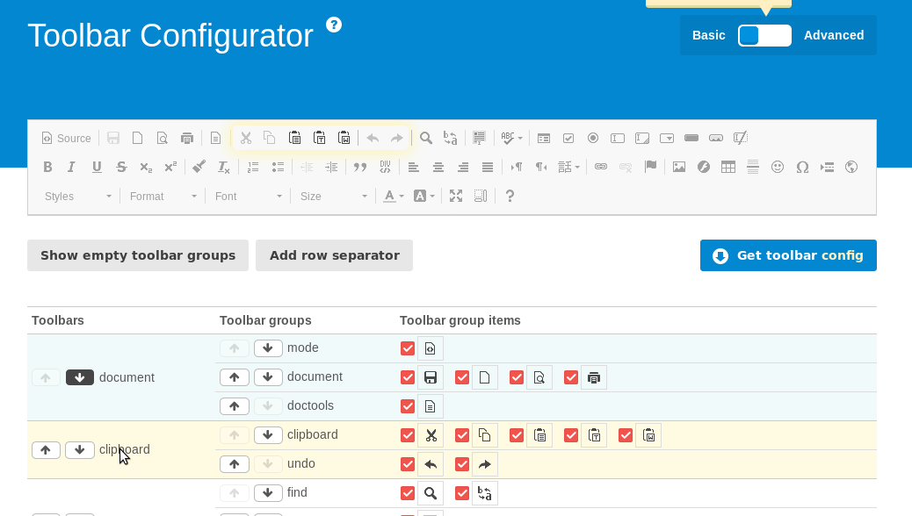

.. include:: /Includes.rst.txt

.. _config-examples:

======================
Configuration Examples
======================

.. tip::

   Use the CKEditor `Toolbar Configurator
   <https://ckeditor.com/latest/samples/toolbarconfigurator/index.html#basic>`__
   to assist you in creating your custom configuration.

How Do I Use a Different Preset?
================================

Instead of using the default "default" preset, you can change this, for example
to "full", using **Page TSconfig**:

.. code-block:: typoscript

   RTE.default.preset = full

Of course, the preset must already exist, or you must define it. `rte_ckeditor`
ships with presets "minimal", "default" and "full".

Additionally, you can set specific presets for specific types of textfields.

For example to use preset "full" for the field "bodytext" of all content elements:

.. code-block:: typoscript

   RTE.config.tt_content.bodytext.preset = full

To use preset "minimal" for the field "bodytext" of only content elements
with ctype="text":

.. code-block:: typoscript

   RTE.config.tt_content.bodytext.types.text.preset = minimal

For more examples, see :ref:`t3tsconfig:pageTsRte` in "TSconfig Reference".

How Do I Create My Own Preset?
==============================

In your sitepackage extension:

In :file:`ext_localconf.php`, replace `my_extension` with your extension key, replace `my_preset` and `MyPreset.yaml`
with the name of your preset.

.. code-block:: php

   $GLOBALS['TYPO3_CONF_VARS']['RTE']['Presets']['my_preset'] = 'EXT:my_extension/Configuration/RTE/MyPreset.yaml';

In :file:`Configuration/RTE/MyPreset.yaml`, create your configuration, for example::

   # Import basic configuration
   imports:
    - { resource: "EXT:rte_ckeditor/Configuration/RTE/Processing.yaml" }
    - { resource: "EXT:rte_ckeditor/Configuration/RTE/Editor/Base.yaml" }
    - { resource: "EXT:rte_ckeditor/Configuration/RTE/Editor/Plugins.yaml" }
   # Add configuration for the editor
   # For complete documentation see http://docs.ckeditor.com/#!/api/CKEDITOR.config
   editor:
     config:
       # Include custom CSS
       contentsCss: "EXT:my_extension/Resources/Public/Css/rte.css"

How Do I Customize the Toolbar?
===============================

Since CKEditor 4, there are 2 ways to customize the toolbar buttons:

Using `editor.config.toolbar <https://ckeditor.com/docs/ckeditor4/latest/guide/dev_toolbarconcepts.html#item-by-item-configuration>`_
   This has the advantage,
   that each button is configured individually
   and it gives you more control over what is displayed in the toolbar.

Using `editor.config.toolbarGroups <https://ckeditor.com/docs/ckeditor4/latest/guide/dev_toolbarconcepts.html#toolbar-groups-configuration>`__
   This has the advantage,
   that new buttons that have been added by plugins will automatically appear.

This is explained in the
`Toolbar documentation <https://ckeditor.com/latest/samples/old/toolbar/toolbar.html>`__

.. _config-example-toolbargroup:

Configuration Using the toolbarGroups Method
--------------------------------------------

Each button is in a specific toolbarGroup. You can configure various toolbars, containing
one or more toolbarGroups.

Example::

   toolbarGroups:
     - { name: clipboard, groups: [ clipboard, cleanup, undo ] }

In the example, the toolbar "clipboard" will contain the toolbarGroups "clipboard", "cleanup" and
"undo" and all buttons which are assigned to these groups will be displayed in the toolbar
in the defined order.

To find out which buttons exist and which are in which toolbar group, you can
go to the `toolbar configurator <https://ckeditor.com/latest/samples/toolbarconfigurator/index.html#basic>`__.

While you hover over the various toolbars, a selection box corresponding to the toolbar
will be displayed in the sample toolbar at the top.

When you are ready, click :guilabel:`"Get toolbar config"` to see the configuration.

How do I add Custom Plugins?
============================

See `EXT:rte_ckeditor/Configuration/RTE/Editor/Plugins.yaml
<https://github.com/typo3/typo3/blob/main/typo3/sysext/rte_ckeditor/Configuration/RTE/Editor/Plugins.yaml>`__
for a list of plugins, that are already integrated in `rte_ckeditor`. Besides this, the wordcount plugin was added as
npm package. You can find it within :file:`typo3/sysext/rte_ckeditor/Resources/Public/JavaScript/Contrib/plugins/wordcount/`.

Additionally, a large number of `plugins <https://ckeditor.com/cke4/addons/plugins/all>`__
are available and can be freely used.

In this example, we integrate the plugin `codesnippet <https://ckeditor.com/cke4/addon/codesnippet>`__.

.. rst-class:: bignums

1. Go to the start page of the plugin

   For example: `codesnippet <https://ckeditor.com/cke4/addon/codesnippet>`__.

2. Click :guilabel:`Download`

3. Unzip the plugin zip archive,

   For example extract the files to the directory
   :file:`my_extension/Resources/Public/CKeditor/Plugins/codesnippet/`

4. Include the path to the plugin in your Yaml configuration, for example:

   :file:`EXT:my_extension/Configuration/RTE/MyPreset.yaml`::

       editor:
          externalPlugins:
              codesnippet:
                  resource: "EXT:my_extension/Resources/Public/CKeditor/Plugins/codesnippet/"

   Each CKEditor plugin must have a javascript file called :file:`plugin.js` per convention.
   If this is not the case, you must reference the whole path including the javascript file.

5. Configure

   Check if further configuration is necessary, by looking in the plugin documentation

   .. todo: link to an example configuration of a CKEditor plugin (example config e.g. of "wordcount" plugin)

6. Make sure the new button is visible in the toolbar

   Now, remove cache and reopen a text element, look for the new button
   "Insert Code Snippet".

   If the button is not displayed, it is possible, that the toolbarGroup has not
   been activated. Search for "toolbar" in the plugin to find out which toolbarGroup
   is being used, in the case of the plugin "codesnippet", it is the toolbarGroup
   "insert". This should be activated by default.

7. Use the plugin

   .. image:: images/codesnippet.png
      :class: with-shadow

.. -------------------------------------
.. todo: additional questions
   What are stylesets?
   Some configuration can be done with Page TSconfig, some with TCA and some with YAML and some with either 2 or more of these. Why and what should be configured where?
   How can I configure classes to anchor tags?
   What is the contents.css?
   How can I set specific classes for anchors?
   How can I extend custom tags?
   How can I add images?
   How can I configure tables?
   How can I add more attributes to anchor tags?
   How can I allow / deny specific tags?
   How to add custom styles for ul tags?
