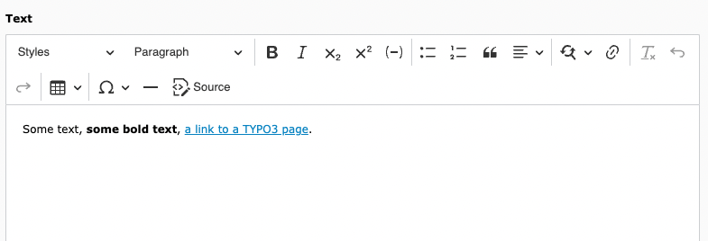

.. include:: ../Includes.txt

.. _introduction:

============
Introduction
============

.. _what-it-does:

What does it do?
================

The extension `rte_ckeditor` provides a rich text editor (RTE) by integrating
`CKEditor 4 <https://ckeditor.com/ckeditor-4/>`__ into TYPO3.

This makes it possible to
use the features of CKEditor when editing rich text fields in the TYPO3
backend or frontend (if frontend editing is used). Rich text fields are
fields which may contain text with markup, for example for adding a style
such as bold, using lists or enumerations, headlines or adding links.

   Editing a textfield in the backend with rte_ckeditor.

CKEditor is a :abbr:`WYSIWYG (what you see is what you get)` editor mostly written
in JavaScript, and is used in many systems due to its flexibility. There are hundreds
of free open-source plugins for CKEditor to enhance the editing experience.

History
=======

CKEditor was officially integrated as the default rich text editor in TYPO3 v8 LTS,
within an extension called `rte_ckeditor`.

Before TYPO3 v8, a custom fork of “HtmlArea”, another open-source WYSIWYG editor
was shipped with TYPO3 Core in a separate extension `rtehtmlarea`. The latter
extension is still fully functional, but must be installed separately
when updating from previous TYPO3 versions.

.. _features:

Features
========

The extension `rte_ckeditor` incorporates the features of CKEditor and adds
additional functionality, configuration presets and plugins.

There are numerous `plugins <https://ckeditor.com/cke4/addons/plugins/all>`__
available for CKeditor. Some plugins have already been
integrated into `rte_ckeditor` and new plugins have been written for TYPO3.

Some examples of features:

* Configurable via Yaml files
* Configuration presets (minimal, default, full) for TYPO3
* Toolbar customization
* Link functionality: integration with TYPO3 link wizard
* Softhypen: plugin for adding :kbd:`ctrl` + :kbd:`-` support to insert a conditional word break

