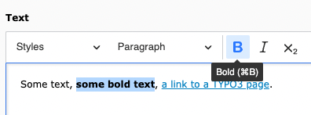
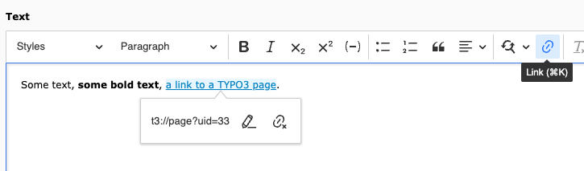

..  include:: /Includes.rst.txt

..  _usage:

===========
Basic Usage
===========

How the editor toolbar looks and what is available will depend on the
currently used configuration.

The CKEditor will be active for RTE fields, for example the Text field
of a content element.

For information about working with content elements, see the section
:ref:`t3editors:content-editing` and :ref:`t3editors:rte` in the
"Tutorial for Editors".

The following examples are done using the
preset which is installed with the Introduction Package.

Example: Use bold
=================

Select text and click on the **B** (for bold) button:

Example: Create a link
======================

Select text and click on the Link button:

