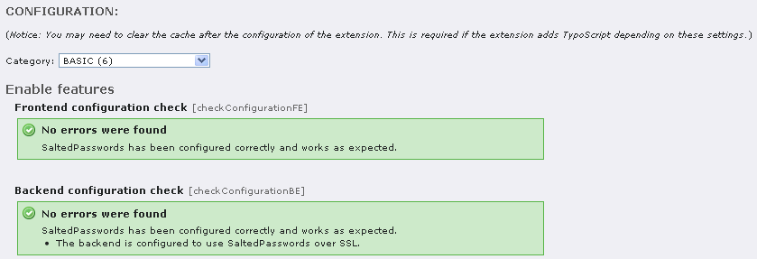

.. ==================================================
.. FOR YOUR INFORMATION
.. --------------------------------------------------
.. -*- coding: utf-8 -*- with BOM.

.. include:: ../Includes.txt

.. _installation:

Installation
------------

.. _installing:

Installing the extension
^^^^^^^^^^^^^^^^^^^^^^^^

Install the extension in the Extension Manager!

Please open the  **TYPO3 install tool** . Depending on which TYPO3
mode (FE or BE) you like to use salted user password hashes for,
please change the according "**loginSecurityLevel**" configuration
variable! A valid setting for working salted user password hashes are

- "**rsa**" (requires installed system extension rsaauth; sends
  password over an encrypted channel) or

- "**normal**" (send passwords in plain-text; works for TYPO3 frontend
  and backend; please use SSL to send password over an encrypted
  channel)

Now return back to the Extension manager and again open the extension
configuration for system extension "Salted user password hashes" (saltedpasswords)!

Depending on which TYPO3 mode (FE or BE) you like to use salted user
password hashes for, activate the according **checkbox** "**Enable FE**" or "**Enable BE**"!

Additionally, you might want to change the hashing method. See
previous chapter for an explanation on when to use which method.

When done, please click the update button!

.. _setup-check:

Checking the setup
^^^^^^^^^^^^^^^^^^

The extension brings a smart configuration check with it.
Success/warning/error messages will report the status of the
configuration. In case of problems, it will show up advices which
steps are wrong or missing.

A successful configuration will show up like following:

   Extension configuration check in the Extension Manager

.. _re-use-of-existing-passwords-when-upgrading-to-typo3-core-4-3:

Re-use of existing passwords when upgrading to TYPO3 Core 4.3
^^^^^^^^^^^^^^^^^^^^^^^^^^^^^^^^^^^^^^^^^^^^^^^^^^^^^^^^^^^^^

If you have previously used extension t3sec\_saltedpw, you don't have
to worry at all. The extension will gracefully accept these passwords.

If you have password records in form of plain-text passwords or MD5,
the extension will use them too and update the records to salted user
password hashes as long as you deactivate "**Exclusive Usage**" and
activate "**Update user passwords**" (default settings, see
extension configuration chapter in this manual for details)

.. _compatibility-with-extensions:

Compatibility with extensions
^^^^^^^^^^^^^^^^^^^^^^^^^^^^^

All TYPO3 Core system extensions are compatible with Salted user
password hashes. This means that authentication works (see
installation chapter for requirements), login works (using system
extension felogin) and creating/editing user records in the TYPO3
backend is working too.

Most frontend user registration extensions support salted passwords
during account creation, but this can obviously not be guaranteed.
You are advised to test the extension and check what is actually
written in the database for the password field.

If your favourite extension still does not support Salted user
password hashes, please file a feature request for these projects and
refer to this manual. We're sure that acceptance will increase in near
future.

