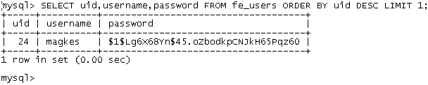

.. ==================================================
.. FOR YOUR INFORMATION
.. --------------------------------------------------
.. -*- coding: utf-8 -*- with BOM.

.. include:: ../Includes.txt

.. _introduction:

Introduction
------------

.. _what-does-it-do:

What does it do?
^^^^^^^^^^^^^^^^

This extension allows to store a user's password in form of a salted
hash. Together with this possibility it brings also a necessary
authentication service to use such salted password hashes.

.. _screenshots:

Screenshots
^^^^^^^^^^^

   Example salted user password hash of a FE user record

.. figure:: ../Images/ExtensionConfigurationCheck.png
   :alt: Extension configuration check

   Extension configuration check in the Extension Manager

