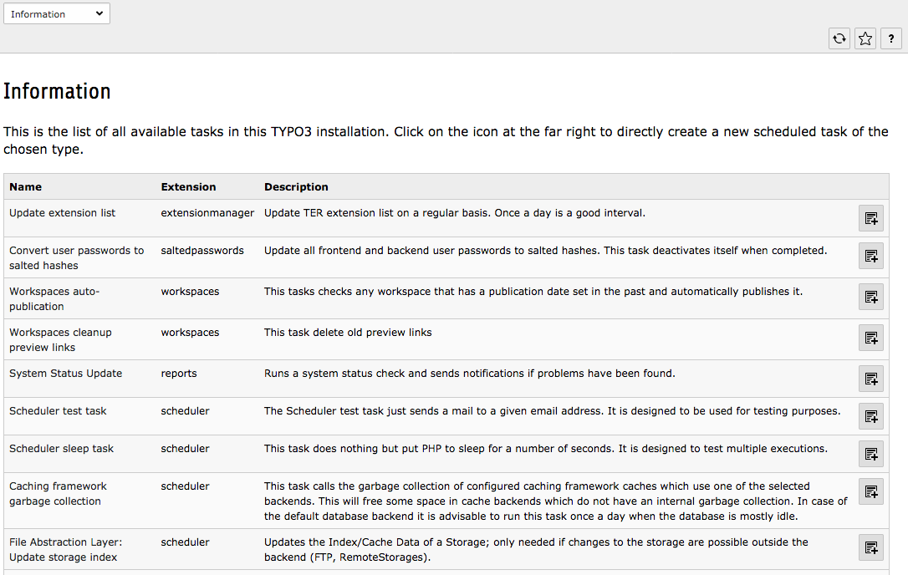
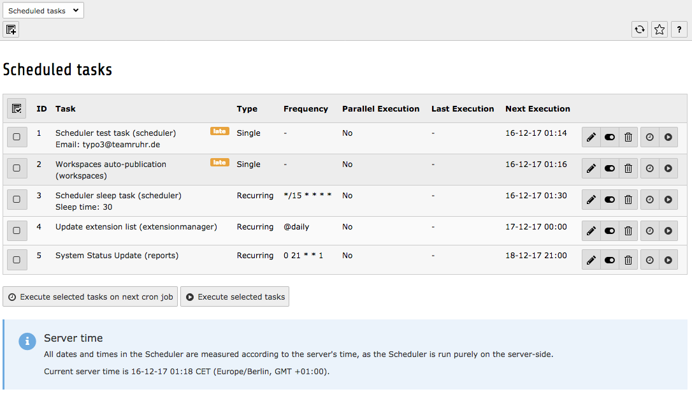
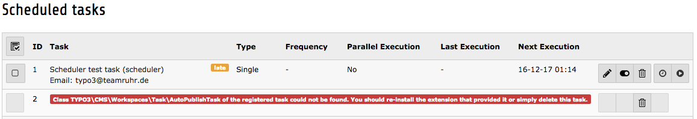

.. ==================================================
.. FOR YOUR INFORMATION
.. --------------------------------------------------
.. -*- coding: utf-8 -*- with BOM.

.. include:: ../../Includes.txt

.. _backend-module:

The backend module
^^^^^^^^^^^^^^^^^^

.. _setup-check-screen:

The setup check screen
""""""""""""""""""""""

This screen has already been mentioned in the :ref:`Installation chapter <setup-check>`.
It is mostly useful when setting up the Scheduler, as it indicates
whether the necessary "\_cli\_scheduler" BE user exist or not and
whether the CLI script is executable or not. When everything is
running fine, it contains mostly one useful piece of information: when
the last run took place, when it ended and whether it was started
manually (i.e. from the BE module) or automatically (i.e. from the
command line).

.. _information-screen:

The information screen
""""""""""""""""""""""

This screen shows a list of all available tasks in the current TYPO3
installation. When the Scheduler has just been installed, this will be
limited to the two base tasks provided by the extension. The screen
shows the name and description of the task. Clicking on the "Add" icon
on the right side of each row will open up the new task registration
screen, with the task class already predefined.

   List of available tasks in the Scheduler's information screen

.. _scheduled-tasks-screen:

The scheduled tasks screen
""""""""""""""""""""""""""

This is the main screen when administering tasks. At first it will be
empty and just offer a link to add a new task. When such registered
tasks exists, this screen will show a list with various pieces of
information.

   Main screen of the Scheduler BE module

Disabled tasks appear in grayed-out text. A disabled task is a
task that will not be run automatically by the command-line script,
but may still be executed from the BE module.

A late task will appear this way:

.. figure:: ../../Images/LateTask.png
   :alt: A late task in the Scheduler main screen

   A late task in the main screen of the Scheduler BE module

The table at the center of the above screenshot shows the
following:

- The first column contains checkboxes. Clicking on a checkbox will
  select that particular scheduled task for immediate execution.
  Clicking on the icon at the top of the column will toggle all
  checkboxes. To execute the selected tasks, click on the "Execute
  selected tasks" button. Read more in "Manually executing a task"
  below.

- The second column contains possible actions, mainly editing or
  deleting a task. The actions will be unavailable for a task that is
  currently running, as it is unwise to edit or delete it a task in such
  a case. Instead a running task will display a "stop" button (see
  "Stopping a task" below).

- The third column simply displays the id of the task.

- The fourth column contains the name of the task, the extension it is
  coming from and any additional information specific to the task (for
  example, the e-mail to which the "test" task will send a message or
  the sleep duration of the "sleep" task). It also show a summary of the
  task's status, as a bullet. More details below.

- The fifth column shows whether the task is recurring or will run only
  a single time.

- The sixth column shows the frequency.

- The seventh columns indicates whether parallel executions are allowed
  or not.

- The eighth column shows the last execution time and indicates whether
  the task was launched manually or was run via the command-line script
  (cron).

- The last column shows the planned execution time. If the task is
  overdue, the time will show up in bold, red numbers. A task may have
  no future execution date if it has reached its end date, if it was
  meant to run a single time and that execution is done, or if the task
  is disabled. The next execution time is also hidden for running tasks,
  as this information makes no sense at that point in time.

Note that all dates and times are displayed in the server's time zone.
The server time appears at the bottom of the screen.

At the bottom of the screen is a link to add a new task and a legend
explaining the various states shown in the tasks list. This is pretty
much self-explanatory. If there are a lot of tasks that appear late,
consider changing the frequency at which the cron job is running (see
"Choosing a frequency" above).

Occasionally the following display may appear:

   A scheduled task missing its corresponding class

This will typically happen when a task provided by some
extension was registered, then the extension was uninstalled, but the
task was not deleted beforehand. In such a case, this task stays but
the Scheduler doesn't know how to handle it anymore. The solution is
either to install the related extension again or delete the registered
task.

