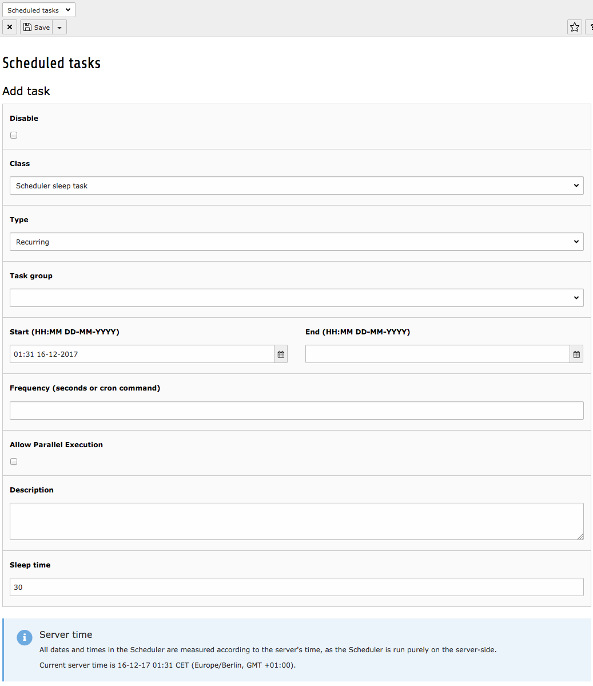
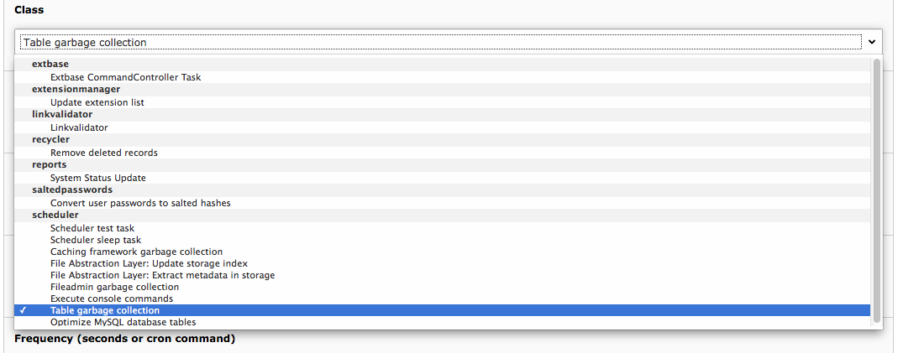
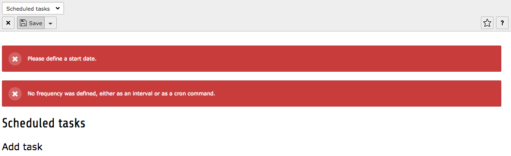
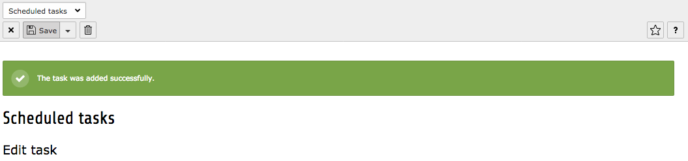

.. ==================================================
.. FOR YOUR INFORMATION
.. --------------------------------------------------
.. -*- coding: utf-8 -*- with BOM.

.. include:: ../../Includes.txt

.. _adding-editing-task:

Adding or editing a task
^^^^^^^^^^^^^^^^^^^^^^^^

When adding or editing a task, the following form will show up:

   Adding a new scheduled task

Some fields require additional explanations (inline help is
available by moving the mouse over the field labels):

- A disabled task will be skipped by the command-line script. It may
  still be launched manually, as described above.

- The class selector is available only when adding a new task. The class
  cannot be changed when editing a task, since there's no sense in that.

   Select the class of the scheduled task

- A task must have a start date. The end date is not mandatory, though.
  A task without end date will run forever. Dates and times must be
  entered in the server's time zone. The server's time appears at the
  bottom of the form.

- The frequency needs be entered only for recurring tasks. It can be
  either a number of seconds or a cron-like command. Since TYPO3 4.5 the
  Scheduler supports the full cron syntax, including ranges, steps and
  keywords like :code:`@weekly` . For more information on cron syntax,
  see http://en.wikipedia.org/wiki/CRON\_expression.

- Parallel executions are denied by default (see "Tasks execution"
  above). They must be allowed explicitly.

- At the bottom of the form (highlighted area) there may be one or more
  additional fields. Those fields are specific to each task and will
  change when a different class is selected.

If there are some input errors, the form will reload upon submission
and display the relevant error messages. When the input is finished
and correct, the view switches back to the list view and displays a
confirmation message.

   Input validation failed when adding a new scheduled task or editing an existing one

   Input validation succeeded when adding a new scheduled task or editing an existing one

If an error occurs when validating a cron definition, the
Scheduler's built-in cron parser tries to provide an explanation about
what's wrong.

