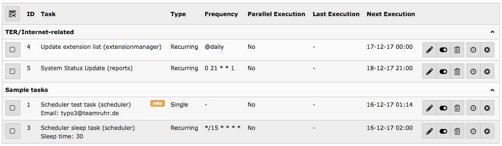
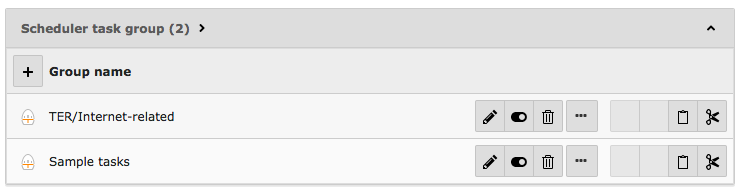

.. ==================================================
.. FOR YOUR INFORMATION
.. --------------------------------------------------
.. -*- coding: utf-8 -*- with BOM.

.. include:: ../../Includes.txt

.. _grouping-tasks:

Grouping tasks together
^^^^^^^^^^^^^^^^^^^^^^^

In case of a high number of different tasks, it may be useful to visually group similar tasks together:

   Grouping related tasks together

Scheduler task groups are records stored on the root page (pid=0). They may be created, edited and sorted with Web > List:

   Management of scheduler task groups

It is also possible to create a new task group from within the edit task form whith clicking on the `+` icon next to the
task group select box.

Individual tasks may then be edited as usual and associated to a given scheduler task group.

The individual groups can be sorted independent of each other by clicking the column label.
With every click it switches between ascending and descending order of the items of the associated column
in the corresponding group.

.. note::
   Tasks inside a hidden group are neither automatically executed nor displayed in the scheduler module.
