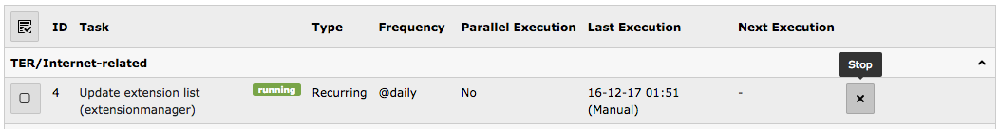

.. ==================================================
.. FOR YOUR INFORMATION
.. --------------------------------------------------
.. -*- coding: utf-8 -*- with BOM.

.. include:: ../../Includes.txt

.. _stopping-a-task:

Stopping a task
^^^^^^^^^^^^^^^

As was explained above, a task is marked as being executed while it is
running. If the process running the task crashes or is killed for some
reason, the task will stay marked as being executed. This will be
cleaned up automatically according to the maximum lifetime parameter
(also described previously), but this may be inconvenient in some
circumstances.

   Stopping a running task from the main screen

In such cases it is possible to use the "stop" button to
clean up marked executions for the given task. This will make it
possible to run this task again. However please note that this will
**not** kill a corresponding still running or continuously hanging
process.

