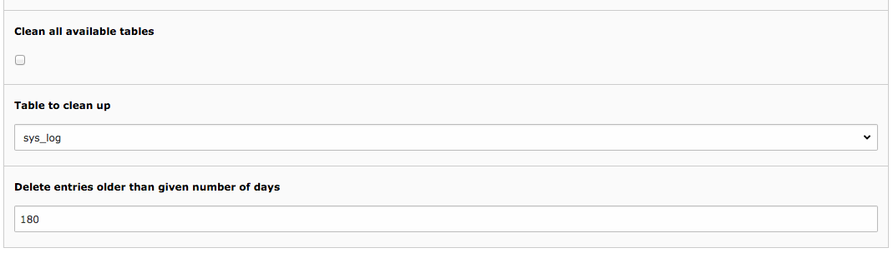

.. include:: /Includes.rst.txt

.. _base-tasks:

The base tasks
^^^^^^^^^^^^^^

The Scheduler comes by default with several tasks:

- **Caching framework garbage collection** : some cache backends do not
  have an automatic garbage collection process. For these it is useful
  to run this Scheduler task to regularly free some space.

- **Fileadmin garbage collection** : empties :file:`_recycler_` folders in
  the fileadmin.

- **Table garbage collection** : cleans up old records from any table in
  the database. See related section below for more information on
  configuration.

.. _table-garbage-collection-task:

Table garbage collection task
"""""""""""""""""""""""""""""

The table garbage collection task can take a more elaborate
configuration which is detailed below.

The task can be registered to clean up a particular table, in which
case you simply choose the table and the minimum age of the records to
delete from the task configuration screen.

   Configuring the table garbage collection task

It's also possible to clean up all configured table by
checking the "Clean all available tables" box. The configuration for
the tables to clean up is stored in
:php:`$GLOBALS['TYPO3_CONF_VARS']['SC_OPTIONS']['scheduler']['tasks'][\TYPO3\CMS\Scheduler\Task\TableGarbageCollectionTask::class]['options']['tables']`.
The syntax is the following:

- option :php:`expireField` can be used to point to a table field
  containing an expiry timestamp. This timestamp will then be used to
  decide whether a record has expired or not. If its timestamp is in the
  past, the record will be deleted.

- if a table has no expiry field, one can use a combination of a date
  field and an expiry period to decide which records should be deleted.
  The corresponding options are :php:`dateField` and :php:`expirePeriod`.
  The expiry period is expressed in days.

.. _table-garbage-collection-task-example:

Example
~~~~~~~

::

   $GLOBALS['TYPO3_CONF_VARS']['SC_OPTIONS']['scheduler']['tasks'][\TYPO3\CMS\Scheduler\Task\TableGarbageCollectionTask::class]['options']['tables']['tx_realurl_errorlog'] = [
      'dateField' => 'tstamp',
      'expirePeriod' => '180',
   ];
   $GLOBALS['TYPO3_CONF_VARS']['SC_OPTIONS']['scheduler']['tasks'][\TYPO3\CMS\Scheduler\Task\TableGarbageCollectionTask::class]['options']['tables']['tx_realurl_uniqalias'] = [
      'expireField' => 'expire',
   ];

The first part of the configuration indicates that records older than
180 days should be removed from table :code:`tx_realurl_errorlog` ,
based on the timestamp field called "tstamp". The second part
indicates that old records should be removed from table
:code:`tx_realurl_uniqalias` directly based on the field "expire"
which contains expiration dates for each record.

.. _other-tasks:

Other tasks
"""""""""""

More tasks are provided by system extensions, such as the Extension
Manager, which defines one for updating the available extensions list.

The base tasks are also there to serve as examples for task developers
(see :ref:`developer-guide`).

