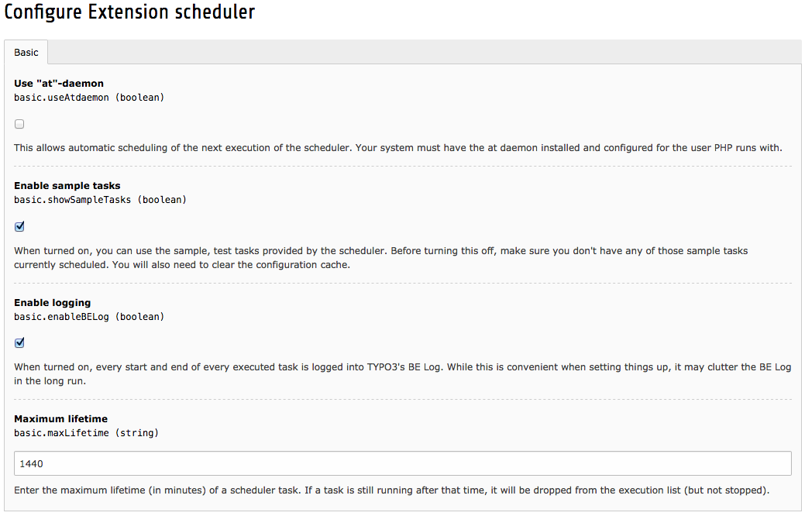

.. ==================================================
.. FOR YOUR INFORMATION
.. --------------------------------------------------
.. -*- coding: utf-8 -*- with BOM.

.. include:: ../../Includes.txt

.. _installing:

Installing the extension
^^^^^^^^^^^^^^^^^^^^^^^^

The process is pretty straightforward: just install the extension in
the Extension Manager. One database table will be created. Once the
extension is installed, the following settings are available:

- **Maximum lifetime** : it may happen that a task crashes while
  executing. In this case it will stay in a state marked as "running".
  That may prevent it from being executed again, if parallel executions
  are denied (see "Tasks execution" above). The maximum lifetime
  parameter ensures that old executions are removed after a while. The
  lifetime is expressed in **minutes** . The default is 15 minutes.

- **Enable logging** : by default, the Scheduler will write an entry in
  the BE log every time it starts and ends, and also when it skips a
  (denied) parallel execution. This is helpful when setting up a system,
  but it may end up cluttering the log in the long run. It's possible to
  turn off all logging by unchecking this option.

- **Enable sample tasks** : the Scheduler provides two sample tasks
  (called "Scheduler test task" and "Scheduler sleep task") which are
  useful during development and as code examples. However they have
  little use in real life, so this option makes it possible to turn them
  off. If disabled, they won't appear in the list of available tasks
  anymore.

    Configuring the extension settings

