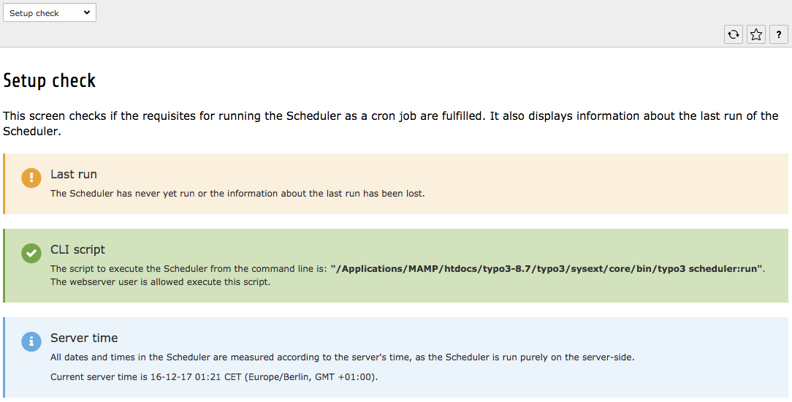

.. ==================================================
.. FOR YOUR INFORMATION
.. --------------------------------------------------
.. -*- coding: utf-8 -*- with BOM.

.. include:: ../../Includes.txt

.. _setup-check:

Checking the setup
^^^^^^^^^^^^^^^^^^

After installing the Scheduler, go to its BE module and call up the
"Setup check" screen which runs a couple of basic checks on your
installation. It will probably look something like this:

   Checking the setup of the Scheduler

The first warning just means that the Scheduler has never run
yet and can be safely ignored for now. The second message is an error
and must be addressed. See next section.

The third message should normally be okay. If there's an error
instead, it means that permissions to execute TYPO3's command-line
dispatcher must be checked (this is not strictly related to the
Scheduler).

