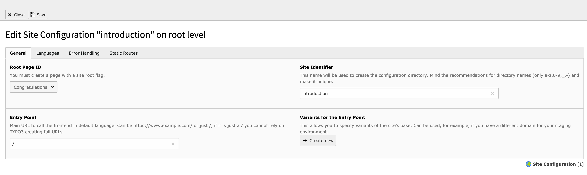

.. include:: /Includes.rst.txt

.. _configuration:

=============
Configuration
=============

Target group: **Developers, Integrators**

..  contents::
    :caption: Content on this page
    :depth: 1

..  toctree::
    :caption: Subpages
    :glob:

    *

.. _configuration-site-sets:

Site sets
=========

..  versionadded::13.3
    EXT:seo now offers a site set "SEO Sitemap" to include the TypoScript to
    output the XML sitemap.

Include the site set "SEO Sitemap" via the :ref:`site set in the site
configuration <t3coreapi:site-sets>` or the custom
:ref:`site package's site set <t3sitepackage:site_set>`.

Settings for the included set can be adjusted in the :ref:`settings-editor`.

..  figure:: /Images/SiteSet.png

    Add the site set "SEO Sitemap"

This will change your site configuration file as follows:

..  literalinclude:: _site_config.diff
    :caption: config/sites/my-site/config.yaml (diff)

If your site has a custom :ref:`site package <t3sitepackage:start>`, you
can also add the "SEO Sitemap" set as dependency in your site's configuration:

..  literalinclude:: _site_package_set.diff
    :caption: EXT:my_site_package/Configuration/Sets/MySite/config.yaml (diff)

TypoScript Settings
===================

There are a couple of TypoScript settings that can influence the output regarding SEO.

-   :ref:`config.pageTitleFirst <t3tsref:setup-config-pagetitlefirst>`
-   :ref:`config.pageTitleSeparator <t3tsref:setup-config-pagetitleseparator>`
-   :ref:`config.pageTitleProviders <t3tsref:setup-config-pagetitleproviders>`
-   :ref:`config.noPageTitle <t3tsref:setup-config-nopagetitle>`

Site configuration
==================

The configuration of sites is done with the :guilabel:`Site Management > Sites` module.
As the settings for your websites are important for SEO purposes as well, please make sure you check the following fields.

   Example site

To get more in depth information about the site handling please refer to the :ref:`t3coreapi:sitehandling` docs.

Entry Point
-----------

Please ensure, that you have configured your sites so that they all have an entry point. This is used for
properly generating the canonical tags, for example.

.. warning::

   Please be aware that for SEO purposes it is best practice to use a fully qualified domain name (for example:
   `https://www.example.com/en/`).
   Therefore TYPO3 requires to enter such a full domain name for your `Entry Point` configuration to support
   SEO enhancements as intended.

Languages
---------

Ensure, that you setup the site languages correctly. All languages should have the right information in the :guilabel:`Locale`
and other language-dependant input fields. When set correctly, TYPO3 will automatically connect your page in the different languages
so that search engines understand their relations. This it to ensure that the search engine knows which page to show
when someone is searching in a specific language.

.. hint::

   Even if you have only one language, make sure all language input fields in the :guilabel:`Locale` tab are also set correctly.
   Giving wrong information to search engines will not help you to rank higher.

See :ref:`t3coreapi:sitehandling-addingLanguages` for more details.

Error Handling
--------------

Although TYPO3 will respond with a HTTP status code `404 (Not found)` when a page is not found, it is best practice to
have a proper content telling the user that the page they requested is not available. This can guide them to another
page or for example to a search function of your website.

See :ref:`t3coreapi:sitehandling-errorHandling` for more details.

robots.txt
----------

The :file:`robots.txt` file is a powerful feature and should be used with care. It will deny or allow search engines to access your pages.
By blocking access to your pages, search engines won't crawl these pages. You should make sure that this will not
prevent the search engines from finding important pages.

It is best practice to keep your robots.txt as clean as possible. An example of a minimal version of your robots.txt:

.. code-block:: php

   # This space intentionally left blank. Only add entries when you know how powerful the robots.txt is.
   User-agent: *

On :ref:`t3coreapi:sitehandling-staticRoutes` you can find more details on how to create a static route that will show
this information when visiting `https://www.example.com/robots.txt`.

When you want to disallow specific URLs, you can use the
`Index this page <https://docs.typo3.org/permalink/t3editors:seo-page-properties-index-page>`_
option in the page properties or set the robot HTTP header `X-Robots-tag` manually.

Static Routes and redirects
---------------------------

Having correct redirects and choosing the appropriate
:ref:`status code <ext_redirects:http-status-codes>` is a very important part of SEO.

It is possible to manage redirects via the TYPO3
:doc:`redirects <ext_redirects:Index>` extension, but it is not the only option and
from a performance perspective it may not be the best solution. Please also see
:ref:`ext_redirects:best-practices-performance` in the EXT:redirects documentation.

.. _config-tags:

Tags
====

.. _config-hreflang-tags:

Hreflang link-tags
------------------

The generation of the :html:`<link rel="alternate" hreflang="" href="" />`
tags is done automatically if the page is available in other languages.
This feature should work correctly in almost all cases.

TYPO3 is using PSR-14 events to handle the generation of those `hreflang` link-tags.
If, for some reason, you would like to alter or remove the automatically generated
tags, you can register your own EventListener. This EventListener should listen
to the :php:`TYPO3\CMS\Frontend\Event\ModifyHrefLangTagsEvent` event. Just make
sure your EventListener is ordered after the :php:`TYPO3\CMS\Seo\HrefLang\HrefLangGenerator`
listener.

More information how to work with EventListeners can be found in the documentation of :ref:`t3coreapi:EventDispatcher`

.. _config-canonical-tag:

Canonical Tag
-------------

Just like the `hreflang` link-tags, the :html:`<link rel="canonical" href="" />` link-tag is also generated automatically.
If you have a specific edge case, and you don't want TYPO3 to render the tag, you can disable rendering completely.
You can put this line in the :file:`ext_localconf.php` of an extension and also make sure your extension is loaded after `EXT:seo`:

.. code-block:: php

   unset($GLOBALS['TYPO3_CONF_VARS']['SC_OPTIONS']['TYPO3\CMS\Frontend\Page\PageGenerator']['generateMetaTags']['canonical']);

Working links
=============

Links in your website are quite important. You can use third party applications to check all your links, but you can
also use the core extension `EXT:linkvalidator` to ensure all the links in your site are working as expected.

Please check the documentation of :doc:`ext_linkvalidator:Index` .

TypoScript examples
===================

This section will provide you with examples on how to configure several behaviours in the frontend.

Setting missing OpenGraph meta tags
-----------------------------------

Most of the OpenGraph meta tags are rendered automatically when `EXT:seo` is installed. If you
want to add meta tags properties such as `og:title`, `og:description` and `og:image`, you can use
TypoScript code like this:

.. code-block:: typoscript

   page {
     meta {
       og:site_name = YOUR_SITE_NAME
       og:site_name.attribute = property

       og:locale = en_US
       og:locale.attribute = property
       og:locale:alternate {
         attribute = property
         value {
            1 = de_DE
         }
       }
     }
   }

Setting fallbacks for meta tags
-------------------------------

As you can see on :ref:`t3coreapi:metatagapi-configuration` the tags are first
set by PHP and after that the TypoScript config is handled. As `EXT:seo` is only
adding the meta tags for the `SEO` and `Social media` fields (if they are filled in
the page properties), you have some possibilities to add fallbacks.

Because `EXT:seo` is handling the tags in PHP-scope, you are able to add those
fallbacks using TypoScript. You can add those tags with TypoScript and those will
only be rendered when `EXT:seo` has not rendered them.

An example to set a fallback `description` and `og:description`:

.. code-block:: typoscript

   page {
     meta {
       description = Your fallback description tag
       og:description = Your fallback OG:description tag
     }
   }

.. hint::

   Having fallbacks for those fields seems to be a good idea, but please consider
   if you really want those fallbacks. Those meta tags should tell search engines
   or social networks, what the page is about. Social networks also have their own
   fallbacks. Setting a fallback for og:description to the description field might
   not be needed as the social networks have such a fallback as well. So please consider
   if you want to add those tags if they do not bring additional valuable information.

Setting fallbacks for og:image and twitter:image
------------------------------------------------

If you want to have a fallback `og:image` or `twitter:image`, you can use this little snippet.

.. code-block:: typoscript

   page {
     meta {
       og:image.stdWrap.cObject = TEXT
       og:image.stdWrap.cObject {
         if.isFalse.field = og_image
         stdWrap.typolink {
           parameter.stdWrap.cObject = IMG_RESOURCE
           parameter.stdWrap.cObject.file = EXT:your_extension/Resources/Public/Backend/OgImage.svg
           returnLast = url
           forceAbsoluteUrl = 1
         }
       }
       twitter:image.stdWrap.cObject = TEXT
       twitter:image.stdWrap.cObject {
         if.isFalse.field = twitter_image
         stdWrap.typolink {
           parameter.stdWrap.cObject = IMG_RESOURCE
           parameter.stdWrap.cObject.file = EXT:your_extension/Resources/Public/Backend/TwitterCardImage.svg
           returnLast = url
           forceAbsoluteUrl = 1
         }
       }
     }
   }

More information about the Meta Tag API can be found on:

* PHP :ref:`t3coreapi:metatagapi`
* TypoScript :ref:`t3tsref:meta`

Setting defaults for the author on meta tags
--------------------------------------------

This example shows how to set a default author based on the TypoScript constant :typoscript:`{$my.default.author}`:

.. code-block:: typoscript

   page {
     meta {
       author = {$my.default.author}
     }
   }

.. seealso::

   `Recommendations for the description field, TYPO3 explained <https://docs.typo3.org/permalink/t3coreapi:seo-recommendations-field-description>`_
