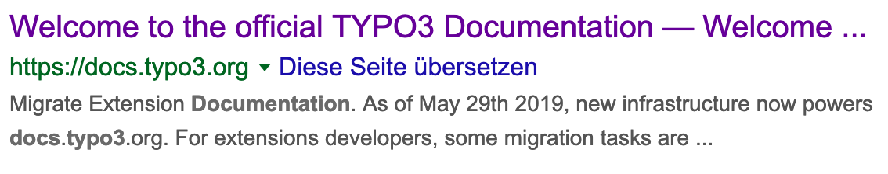
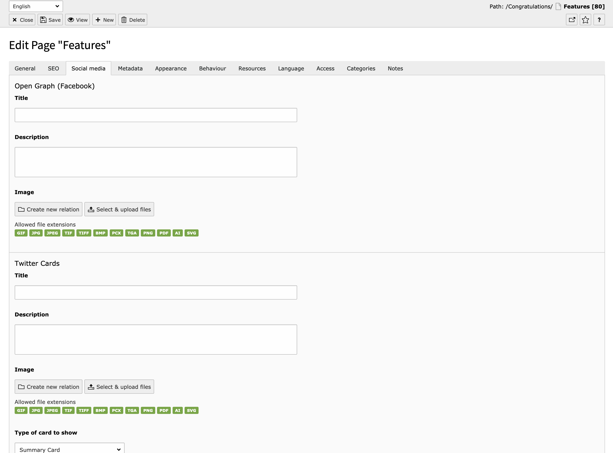
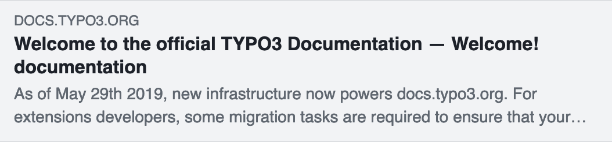
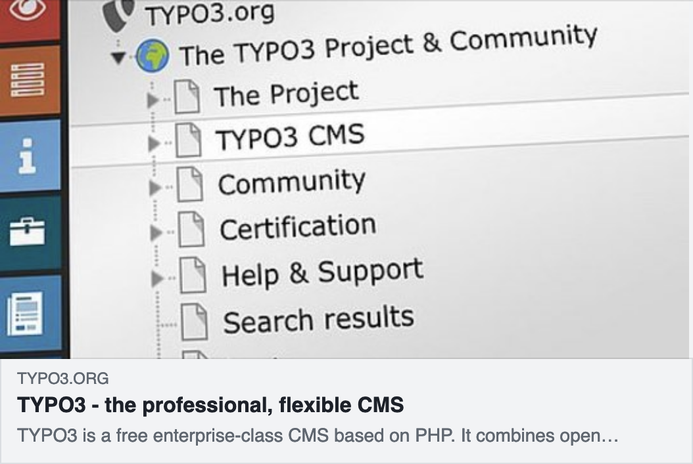

.. include:: /Includes.rst.txt

.. _for-editors:

===========
For Editors
===========

Target group: **Editors**

Welcome to our small SEO introduction.
We will explain the basic fields the TYPO3 core provides and introduce the SEO tools this way.

All the following fields are part of the page record.

You can reach it by:

* Open the Web > Page module
* Use the pen in the top bar icon to edit the page record

An alternative way is to use the context menu.

* Open Web > Page module
* Right click the page you want to edit in the page tree
* Select the Edit action

General tab
===========

.. figure:: ../Images/tab-general.png
   :class: with-shadow
   :alt: General Tab in the TYPO3 Backend

   General Tab in the TYPO3 Backend

Page Title
----------

The page title field is used for several purposes. From a SEO perspective it is mainly used to define the default
URL segment and as a fallback title if you don't set a specific SEO title. More information about the usage of the title
fields can be found at :ref:`title-for-search-engines`.

URL Segment
-----------

The URL segment is the part of the URL the user enters to access your page. Depending on your use case URLs have to
fulfill certain criteria.

By default the URL segment is based on the page tree and page title, but you can override this and set it yourself.

If you want to optimize your page for search engines, it is recommended to have at least the keyword you want to be
found on in your URL segment. Please make sure to check other best practises with your SEO specialist.

SEO Tab
=======

.. figure:: ../Images/tab-seo.png
   :class: with-shadow
   :alt: SEO Tab in the TYPO3 Backend

   SEO Tab in the TYPO3 Backend

.. _title-for-search-engines:

Title for search engines
------------------------

The :guilabel:`Title for search engines` field is used in the `<title>...</title>` tag of your web page. This title is used in the
search results of search engines. There are some best practices for the value of this field.

* Use a speaking title, which targets your audience
* If possible, use the keywords you want to be found on in the title
* Please make sure your title fits in a Google Snippet. You can use 3rd party extensions to help you with this.

When no value for the :guilabel:`Title for search engines` field is defined, it will have a fallback to the field
:guilabel:`Page title`. It will show the page title in the search results in that case.

The title can have the name of the site as a prefix or suffix. The behaviour of this can be defined by an integrator.
By default the title will have the name of the site as a suffix, separated by a dash.

   Google result preview

.. _index-page:

Index this page
---------------

Defines whether the page should be indexed by a search engine or not.

Follow this page
----------------

Defines whether search engines should follow the links on this page.

Canonical link
--------------

You want to avoid duplicate content because your ranking can suffer from this. If you have duplicate content, you have to
link to the origin of the content. This can be an internal page or an external page. You can use the default link wizard
of TYPO3 to select the destination. If you don't set a canonical link yourself, TYPO3 will generate a link to the current
page.

.. hint::

   Avoid duplicate content warnings by supplying the original source of this content.

Change frequency
----------------

This field is used in the XML sitemap and will give search engines a hint how often the content of your page is likely
to change. For example: News in an archive are “never” updated, while your home page might get “weekly” updates.

.. hint::

   Please be aware that this just gives a hint to search engines and search engines can also ignore this information if
   they have better information regarding the change frequency.

Priority
--------

The priority is also used in the XML sitemap. Priority allows you to define how important the page is compared to other
pages on your site. The priority is stated in a value from 0 to 1. Your most important pages can get an higher priority
as other pages. This value does not affect how important your pages are compared to pages of other websites. All pages
and records get a priority of 0.5 by default.

.. hint::

   Please be aware that this just gives a hint to search engines and search engines can also ignore this information if
   they think they have better information regarding the change frequency.

Metadata Tab
============

.. figure:: ../Images/tab-meta-data.png
   :class: with-shadow
   :alt: Metadata Tab in the TYPO3 Backend

   Metadata tab in the TYPO3 Backend

.. _description:

Description
-----------

The description field is important for SEO purposes. This field is used to instruct search engines to use
this text to show as a teaser of your page in the search result snippets. With this description, you can
give the user a clear overview of the topic of this page.

   Google result preview

.. hint::

   It is best practises to at least use the keywords you want to be found on in this description. Make sure the
   description is not too long, so it fits in the search result snippets.

Social media
============

   Social Media Tab in the TYPO3 Backend

The social media tab contains information which is used to enrich the snippet that is shown when visitors share your URLs
in social networks, modern browsers etc.

TYPO3 offers to have different content for OpenGraph (used for example by Facebook and LinkedIn) and Twitter Cards
(used on Twitter of course). Both implementations allow you to set a title, a description and to provide an image. When this
information is not set manually, the social network will decide itself what to show. Most probably it will use the
information from :ref:`title-for-search-engines` and :ref:`description`.

   Facebook preview without image

Title
-----

This title can be specified to be shown as the title of the snippet preview when your page is shared on the social
network. You only have to fill this field when you want a different title as in the search results.

Description
-----------

Used to adjust the description of the preview snippet when your page is shared at a social network. You only have to
fill this field when you want a different description as the description in the search results.

Image
-----

You can specify the image that should be shown when your page is shared on a social network. Please be aware that the
different social networks need specific dimensions for an image. TYPO3 ships with the most used dimension. If you want
to have more dimensions, please let your integrator add more dimensions.

.. hint::

   It is best practise to add an image for social networks so your result will stand out and will be easily recognizable.

   Facebook preview with image
