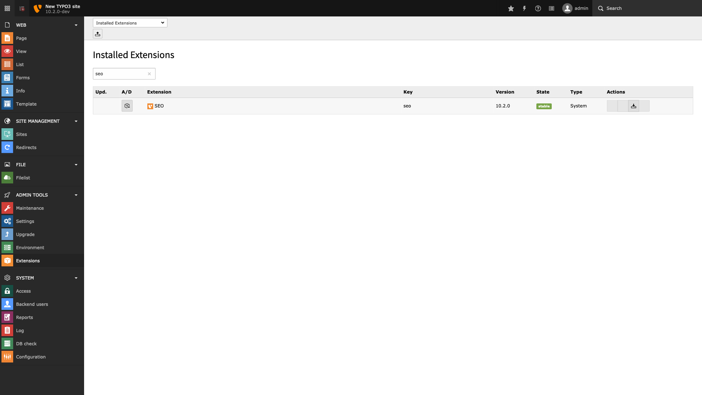

.. include:: /Includes.rst.txt

.. _installation:

============
Installation
============

Target group: **Administrators**

This extension is part of the TYPO3 core.

Installation with composer
==========================

Check whether you are already using the extension with

.. code-block:: bash

   composer show | grep seo

This should either give you no result or something similar to:

.. code-block:: bash

   typo3/cms-seo                                    v9.5.10            SEO features for TYPO3.

If it is not yet installed, use the ``composer require`` command to install the extension

.. code-block:: bash

   composer require typo3/cms-seo ^9.5

The given version depends on the version of the TYPO3 core you are using.

Now head over to the extension manager and activate the extension.

   Extension manager with filtered seo ext

Installation without composer
=============================

In an installation without composer, the code of EXT:seo is already shipped. You just have to activate the extension.
Head over to the extension manager and activate the extension.

   Extension manager with filtered seo ext
