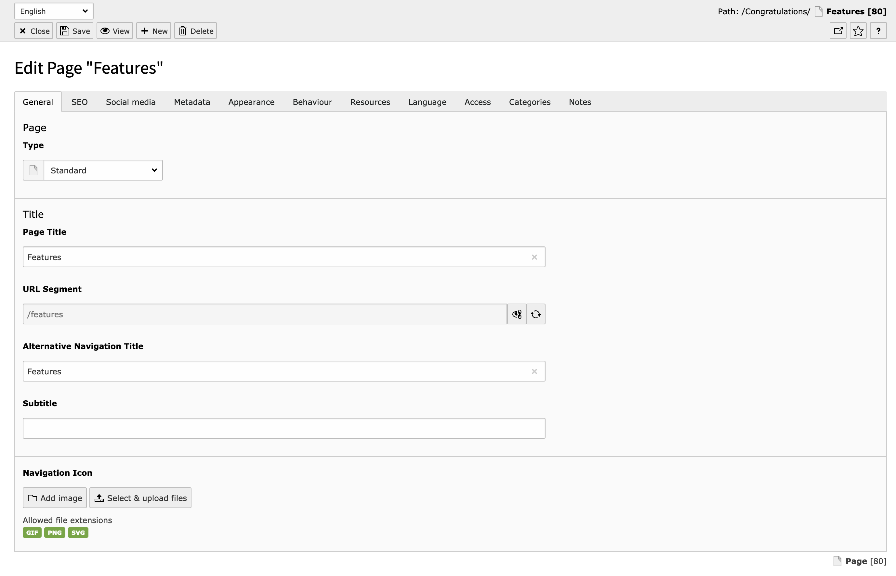
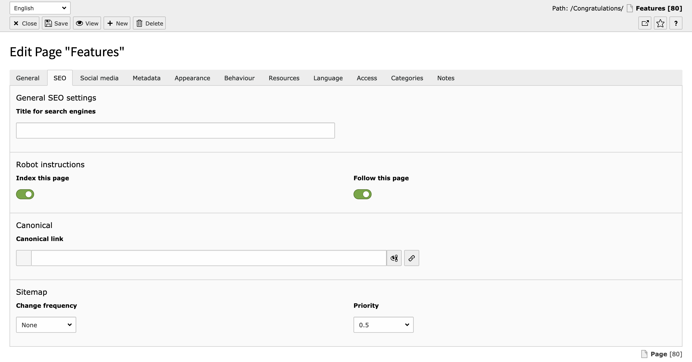
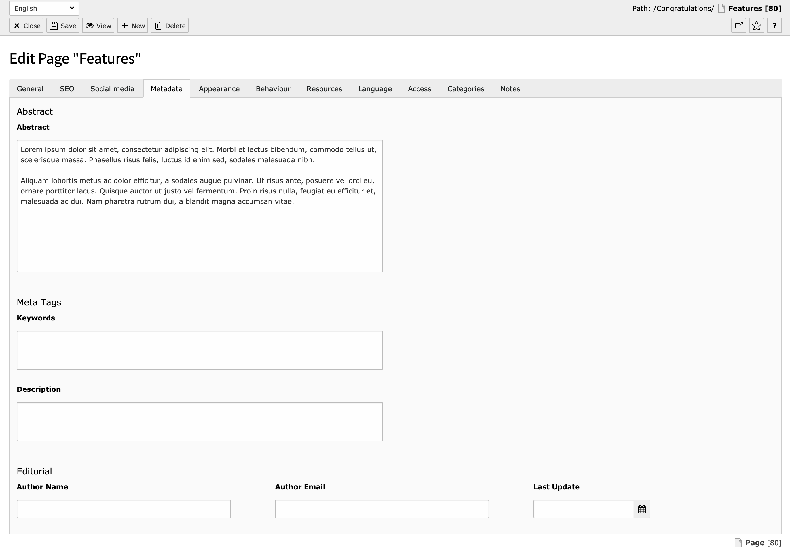

.. include:: /Includes.rst.txt

.. _introduction:

============
Introduction
============

What does it do?
================

The goal of the core extension "seo" is to make sure basic technical Search Engine Optimization (SEO) is done right
out of the box. Specific fields for SEO purposes are added, as well as the rendering of HTML meta tags in the frontend.

There are several things you can do to optimize your site for search engines.
Some tasks are only solvable with good human writers, others are technical tasks, which just need to be implemented.

The goal of the extension seo is to help you with the following parts of your seo journey.

* Give editors all the fields needed to set the necessary meta tags
* Provide the rendering of meta tags in the frontend for SEO related information, to avoid reimplementing it again and again
* Provide stable APIs for developers to give them the chance to change the behaviour when needed in edge cases

This manual will not cover all the developer information, as these are covered in the TYPO3 API documentation.

.. _screenshots:

Screenshots
===========

   General Tab in the TYPO3 Backend

   SEO Tab in the TYPO3 Backend

   Metadata Tab in the TYPO3 Backend

Hreflang Tags
=============
"hreflang" tags are added automatically for multi language websites based on the one-tree principle. The links are
based on the Site configuration and depending on translations of a page.

The :html:`x-default` href is the link of the current page in the default language.

The value of :html:`hreflang` is set for each language in the :guilabel:`Sites module` (see :ref:`t3coreapi:sitehandling-addingLanguages`)

Canonical Tags
==============

TYPO3 provides built-in support for the canonical tag.

If the core extension "seo" is installed, it will automatically add the canonical link to the page.

The canonical link is basically the same absolute link as the link to the current hreflang and is meant
to indicate where the original source of the content is. It is a tool to prevent duplicate content
penalties.

In the page properties, the canonical link can be overwritten per language. The link wizard offers all
possibilities including external links and link handler configurations.

If no canonical link is given manually, TYPO3 will generate a canonicalized URL to the current page in the current
language.

.. warning::
    If you have other SEO extensions installed that generate canonical links, you have to make sure only one creates it.
    If both core and an extension are generating a canonical link, it will result in 2 canonical links which might
    cause confusion for search engines.

XML Sitemap
===========

See :ref:`t3coreapi:xmlsitemap` for the documentation how to configure your XML sitemaps.

