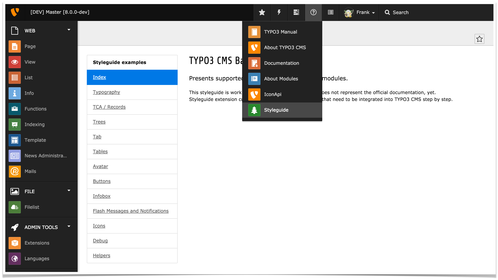

TYPO3 CMS Backend Styleguide
============================




# What is it?

Styleguide is a TYPO3 extension. It provides a backend module that hooks
into the 'Help' menu of the top toolbar of the TYPO3 Backend. It can also create a
page tree to show examples.

This extension in maintained in the official [TYPO3 github organization.](https://github.com/TYPO3/styleguide)

Styleguide is developed "core-near": When TYPO3 core adds or deprecates features
covered by this extension, core developers strive to keep it updated, reflecting
these changes.

Styleguide is a reference to show a lot of TYPO3 backend features, often relevant
for own extensions:

* A set of snippets showing how to use default backend functionality like
  tables, buttons, boxes or notifications.
* A huge set of 'TCA' examples, showing "all" features of the backend editing forms.


# Usages

* The extension is interesting for **backend extension developers** as a reference
  to see how casual stuff like buttons and other HTML related things are solved or
  used in the backend, and to copy+paste solutions. Additionally, the TCA examples
  is a near-complete show-case of [FormEngine](https://docs.typo3.org/m/typo3/reference-coreapi/10.4/en-us/ApiOverview/FormEngine/Index.html)
  (editing records in the backend). Developers will see new things they did not
  know yet. Guaranteed!

* The extension can be interesting for **technical project managers** to get an idea
  of what the backend editing is capable of out-of-the-box and which parts can be
  sold to customers without adding expensive implementation burdens to developers.

* Styleguide is a "require-dev" dependency of the [TYPO3 CMS core mono repository](https://github.com/TYPO3/TYPO3.CMS).
  It is used by **core developers** to test and verify changes to JavaScript, HTML
  and PHP code do not break layout or functionality of backend modules. The extension
  is also used in core backend acceptance tests to verify FormEngine details do not
  break when developing core patches.

* Styleguide is used within the official core documentation to provide examples, screenshots
  and possible usages of core functionality. Especially the [TCA reference](https://docs.typo3.org/m/typo3/reference-tca/master/en-us/)
  heavily relies on it.


# Installation

Styleguide comes as a TYPO3 extension for the TYPO3 backend. It appears as backend module
within the "Help" section of the top toolbar. After initial installation, it is advisable
to let styleguide create an example page tree with records by clicking the
"TCA / records -> Create styleguide page tree with data", and waiting for a couple of
seconds for the system to crunch the data.

## Composer
With [composer based](https://docs.typo3.org/m/typo3/guide-installation/master/en-us/QuickInstall/Composer/Index.html)
TYPO3 installations, styleguide is easily added to the project:

```
composer require --dev typo3/cms-styleguide
```

Composer will automatically find, download and extract the appropriate version. After
that, activate Styleguide using TYPO3 Extension Manager, or via CLI:

```
bin/typo3 extension:activate styleguide
```

## TYPO3 Extension Repository
For non-composer projects, the extension is available in TER as extension key `styleguide` and can
be installed using the extension manager.


# Tagging and releasing

[packagist.org](https://packagist.org/packages/typo3/cms-styleguide) is enabled via the casual github hook.
TER releases are created by the publish.yml github workflow when tagging versions
using [tailor](https://github.com/TYPO3/tailor). The commit message of the commit a tag points to is
used as TER upload comment.

Example:

```
composer install
.Build/bin/tailor set-version 11.0.3
git commit -am "[RELEASE] 11.0.3 Bug fixes and improved core v11 compatibility"
git tag 11.0.8
git push
git push --tags
```


# Legal
This project is released under GPLv2 license. See LICENSE.txt for details.

* The "tree" icon is from [Yusuke Kamiyamane](http://p.yusukekamiyamane.com/)
* Placeholder texts are from [Bacon Ipsum](http://baconipsum.com/)
