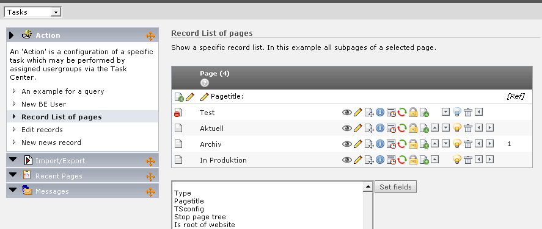

.. ==================================================
.. FOR YOUR INFORMATION
.. --------------------------------------------------
.. -*- coding: utf-8 -*- with BOM.

.. include:: ../Includes.txt

.. _introduction:

Introduction
------------

.. _what-does-it-do:

What does it do?
^^^^^^^^^^^^^^^^

Sys\_actions extends the Taskcenter and provides various actions which
make the life of editors easier. These types of actions exist:

- **Create Backend User:** Using this type a normal editor can create
  and edit backend users using a given user as template.

- **SQL query:** Show the result of special queries.

- **Record list:** Show a record list

- **Edit records:** Simple way to edit common records

- **New record:** Render links to create records

.. _screenshots:

Screenshots
^^^^^^^^^^^

   A typical view of the Task Center with system actions: with an action for rendering a record list

