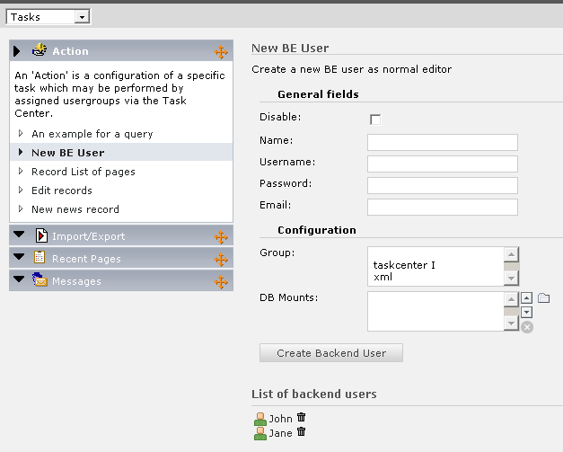

.. ==================================================
.. FOR YOUR INFORMATION
.. --------------------------------------------------
.. -*- coding: utf-8 -*- with BOM.

.. include:: ../../Includes.txt

.. _create-backend-user:

Create Backend User
^^^^^^^^^^^^^^^^^^^

A normal editor is not allowed to create or edit backend user records.
By using this action type any assigned backend user can create, update
and delete backend users. The functionality is limited by defining a
specific user as template record.

   Using the action to create a backend user

Every setting of this template record is copied to a new user except
the fields shown in the screenshot above. An editor is also only
allowed to edit and delete users who have been created by the same
user.

