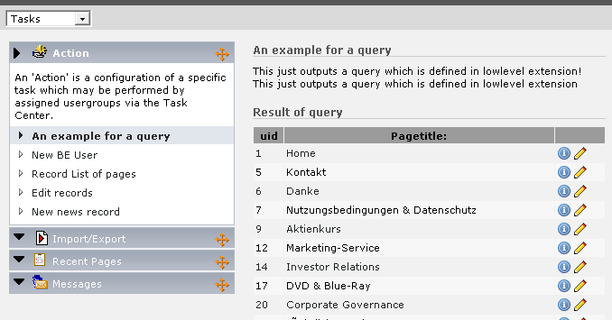
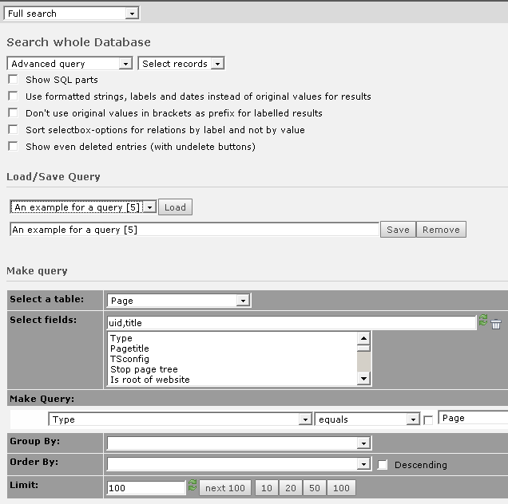

.. ==================================================
.. FOR YOUR INFORMATION
.. --------------------------------------------------
.. -*- coding: utf-8 -*- with BOM.

.. include:: ../../Includes.txt

.. _sql-query:

SQL query
^^^^^^^^^

This action type allows to show the records which are the result of a
SQL query.

   Using the action to view the result of a SQL query

Follow this steps to create this action type:

#. Create a new action record and set the type to "SQL query".

#. Go to the BE module "DB check" > "Full search" > "Advanced query".

#. Create the query you need and save it to the previously created action
   record.

   Creating the SQL query in the DB check module

