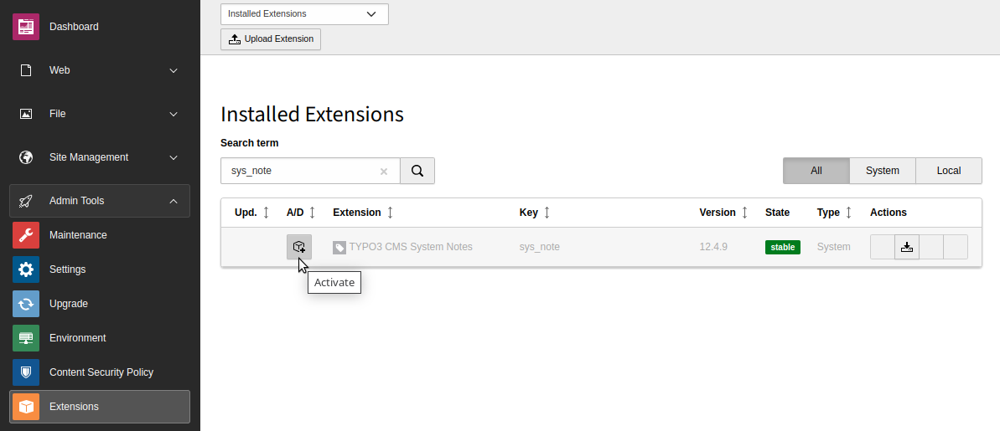

..  include:: /Includes.rst.txt

..  _installation:

============
Installation
============

Target group: **Administrators**

This extension is part of the TYPO3 Core.

Installation with Composer
==========================

Check whether you are already using the extension:

..  code-block:: bash

    composer show | grep sys-note

This should either give you no result or something similar to:

..  code-block:: text

    typo3/cms-sys-note       v12.4.9        TYPO3 CMS System Notes

If it is not installed, use the :bash:`composer require` command to install the
extension:

..  code-block:: bash

    composer require typo3/cms-sys-note

The version installed depends on which version of the TYPO3 Core you are using.

Installation without Composer
=============================

In an installation without Composer, the code of EXT:sys_note is already shipped.
You just have to activate the extension. Head over to the
:guilabel:`Admin Tools > Extensions` module and activate the extension.

    Extension manager with :sql:`sys_note` extension
