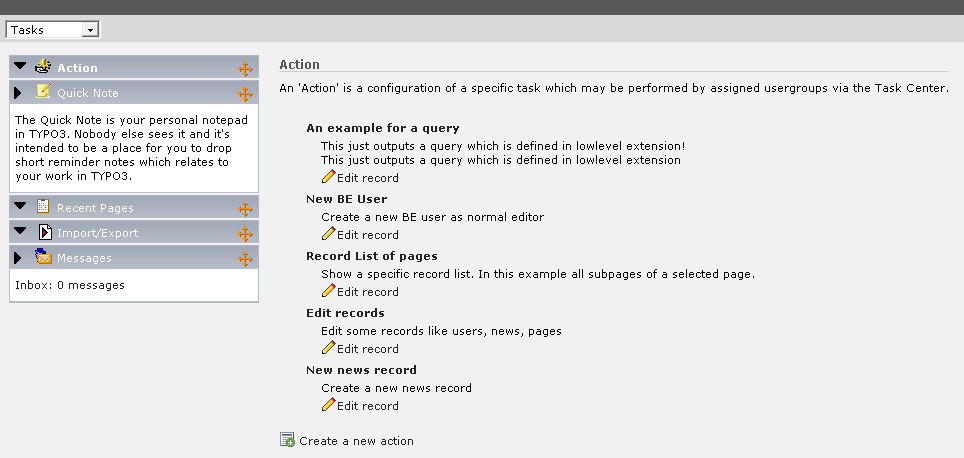

.. ==================================================
.. FOR YOUR INFORMATION
.. --------------------------------------------------
.. -*- coding: utf-8 -*- with BOM.

.. include:: ../Includes.txt

.. _introduction:

Introduction
------------

.. _what-does-it-do:

What does it do?
^^^^^^^^^^^^^^^^

The Taskcenter is designed to be a place to manage all kind of tasks.
It is especially useful for editors to have a central place of common
activities in the TYPO3 backend. The tasks need to be implemented by
other extensions, for example the system extension sys\_actions &
impexp.

.. _screenshots:

Screenshots
^^^^^^^^^^^

This is a view of the BE module's main screen. 5 different tasks are
implemented in this example.

   The BE module with various tasks

