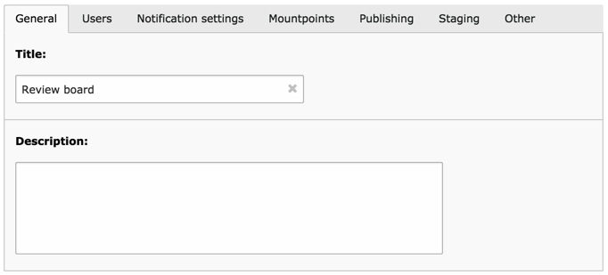
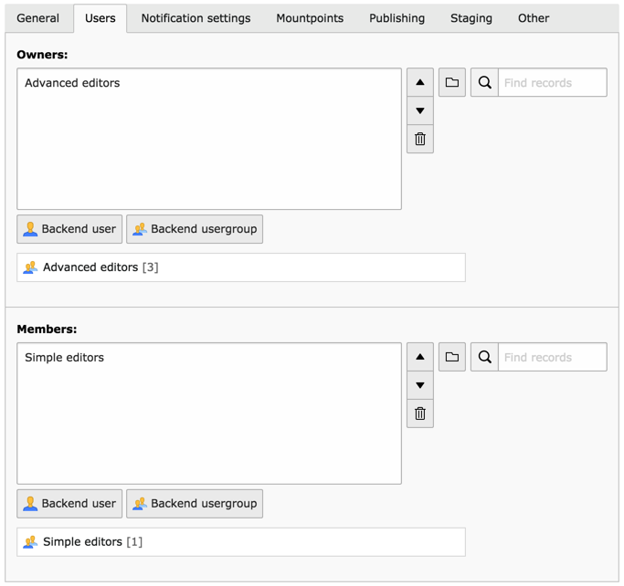
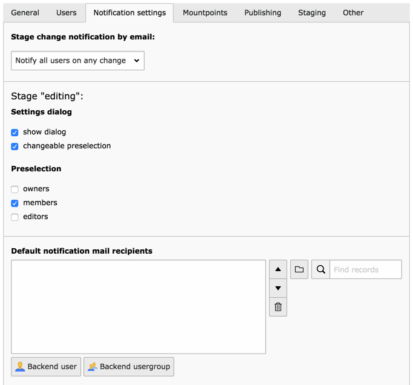
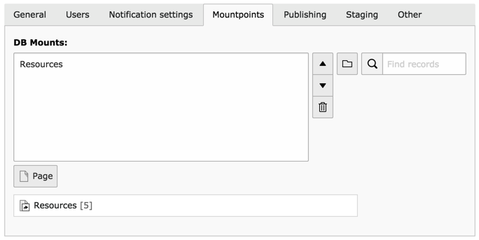
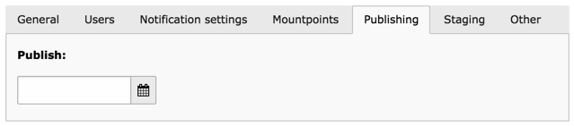
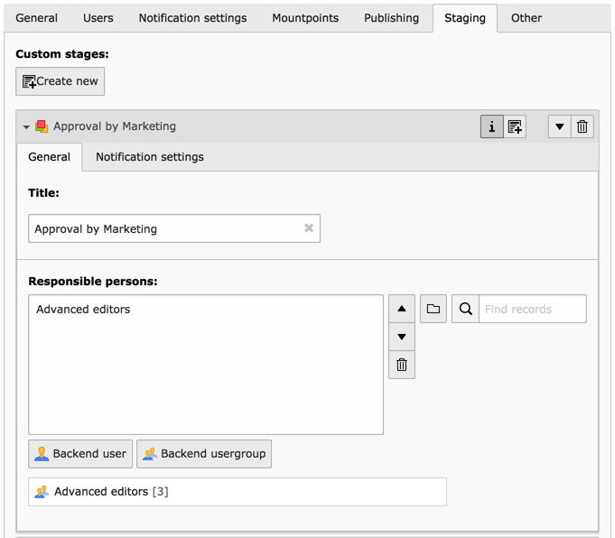
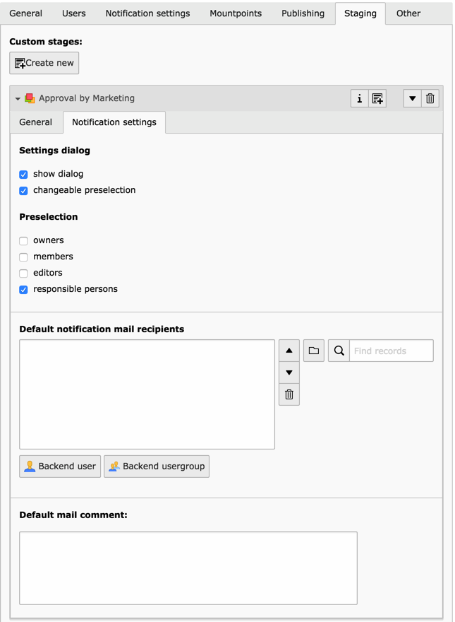
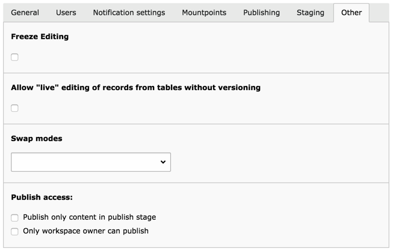

.. include:: ../../Includes.txt

.. _custom-workspace:

Creating a custom workspace
---------------------------

Except for the LIVE workspace (i.e. the default TYPO3 CMS working
environment), some custom workspaces must be created before
anyone can start using the features described in this document.

By default a custom workspace contains three stages, which represent
steps in the validation process: "editing", "ready to publish" and
"publishing execute". Additional stages can be added.

This chapter describes all properties of a workspace, as they
appear in the editing form, grouped by tab.

.. _custom-workspace-general:

General
^^^^^^^

   Entering the general information about the workspace

As with most records in the TYPO3 CMS universe, this is just about
setting a clear title and a helpful description.

.. _custom-workspace-users:

Users
^^^^^

   Setting up owners and members of the workspace

This tab is about setting up user permissions. The "Owners" have
all possible rights over the workspace, including publication to
live. "Members" also have all the rights, although they may be prevented
from publishing with the "Only workspace owner can publish" setting
(see the :ref:`Other tab <custom-workspace-other>`).

.. note::

   As usual, it is recommended to work with groups rather
   than individual users. "Admin" users have access to all
   workspaces and all operations within workspaces.

.. note::

   Users must be given explicit access to the LIVE workspace.
   This is done at the level backend users or backend groups.

   .. figure:: ../../Images/LiveWorkspacesPermission.png
      :alt: Access to the live workspace

      Giving acces to the LIVE workspace to a backend group

.. _custom-workspace-notifications:

Notification settings
^^^^^^^^^^^^^^^^^^^^^

   Fine-grained definition for the notification process

Each time a given change or set of changes moves from one stage
to another (either forward or backward in the review process),
people can be notified about this status change. This tab is
about defining the behavior of the notification process.

With "Stage change notification by email" you can choose
who gets notified. This can be either all users involved
in the workspace (no matter the stage) or only the users
involved with the stage the changes are being sent to.

Subsequently you can configure settings for the three predefined stages.

.. note::

   The screenshot is cropped. The settings are the same for each
   stage.

The "Settings dialog" is about the popup window which appears after
each review process. If the "show dialog" box is not checked, the
popup will not even appear and notifications will be sent according
to the predefined settings. When the "changeable preselection" box
is checked, the preselected list of users to notify can be modified
on the fly before sending the change notification.

The "Preselection" setting makes it possible to choose which users
should be preselected by default in the notification popup.
Furthermore specific users can be added to the list of notified
people using the "Default notification mail recipients" field.

.. _custom-workspace-mounts:

Mountpoints
^^^^^^^^^^^

   Setting alternate mountpoint for the workspace

A workspace can be restricted to one or more mountpoints. These
need not be the same as the mountpoints from the users and groups
that are allowed access to this workspace.

If no mountpoints are defined, the mountpoints from the users
and the groups they belong to are used.

The same applies to file mounts.

.. _custom-workspace-publish:

Publishing
^^^^^^^^^^

   Choosing a publication date for the custom workspace

If a "Publish" date is set, the content of the workspace
will be automatically published on the given date. This requires
the "Workspaces auto-publication" Scheduler task to be activated.

.. note::

   Only the content which is "Ready to publish" is actually
   published.

.. _custom-workspace-staging:

Staging
^^^^^^^

Any number of custom stages can be created. Each corresponds
to an additional step in the review process. Custom stages
can be ordered at will. However they all come after the default
"Editing" stage and before the default "Ready to publish"
stage.

   Setting the general information of a custom stage

In the "General" tab of a custom stage, a restricted set of users
can be chosen from among "Owners" and "Members". They are called
"Responsible persons".

   Defining the notification settings of a custom stage

The notitication settings for a custom stage are mostly the same
as for the default stages, except that the "Responsible persons"
can also be chosen in the predefined list of users to notify
and that a "Default mail comment" can be defined for that stage.

.. note::

   In this context "Editors" means the people that have been
   involved in the change originally.

.. _custom-workspace-other:

Other
^^^^^

   Miscellaneous settings for a custom workspace

The "Other" tab is comprised of various settings affecting
the behavior of the custom workspace.

The "Freeze editing" flag actually blocks all operations in
the workspace until it is turned off again.

It is possible to allow editing of non-versionable records
in the custom workspace. These records will be edited "live",
i.e. any changes to them performed in the workspace will be
directly visible on the web site, rather than going through
the review process.

"Swap modes" defines if swapping should take place or not
upon automatic publishing.

The "Publish access" setting further refines publishing rights.
If the "Publish only content in publish stage" box is checked,
modified content cannot be forcefully published by workspace owners at
whatever stage. It has to reach the "Ready to publish" stage.
Also publication can be restricted to the owners of the
workspace (i.e. members may not publish).

