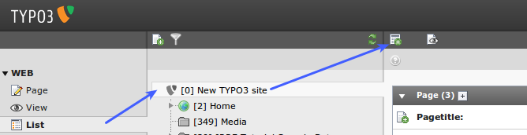
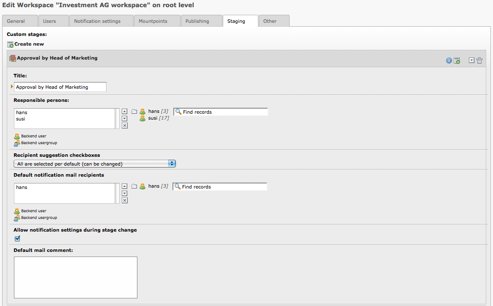

.. ==================================================
.. FOR YOUR INFORMATION
.. --------------------------------------------------
.. -*- coding: utf-8 -*- with BOM.

.. include:: ../Includes.txt

.. _custom-workspace:

Creating a custom workspace
---------------------------

- Go via the Web > List module to the root page of your web site (ID 0)

- Click on the "new record" icon:

   Starting the creation of a new custom workspace

- Choose "Workspace" in the wizard

- Fill in the form – most fields are self-explaining (for the user
  rights see chapter above)

- Add as many stages as you may need (Without any custom stages you will
  have "Edit" and "Ready to Publish")

- Either you just define responsible persons or you further define the
  default notification recipients (these are checked by default in the
  change stage window)

- By disabling the checkbox "Allow notification settings during stage
  change" you are able to hide the recipient suggestions in the change
  stage window

   Tuning the notification settings for the custom workspace

- Save and finished :-)

