.. ==================================================
.. FOR YOUR INFORMATION
.. --------------------------------------------------
.. -*- coding: utf-8 -*- with BOM.

.. include:: ../Includes.txt

.. _users-guide:

Users Guide
-----------

This section shortly covers the workspace related features in the
backend.

Most significantly workspaces have a selector box in the upper right
corner of the backend.

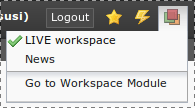

   The workspace selector in the top bar

In this selector box you can choose between the workspaces available.
The whole backend reloads each time he changes workspace. This is
necessary because the backend might be differently composed depending
on the workspace the user is in.

You can easily see in which workspace you are currently in when
looking at the top frame of your backend:

   Current workspace highlighted in the top bar

When the background is orange colored you are in a workspace. The
workspace name is appended to your username (in this case **@News**).

When you are in a draft workspace (any workspace that is not live) and
start editing a page or create a new page a new version of that page
is automatically created for you.

A page which has a change in the current workspace is highlighted in
the page tree:

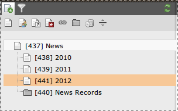

   Modified page highlighted in the page tree

The module  **Web > Workspaces** allows you to monitor changes in a
workspace:

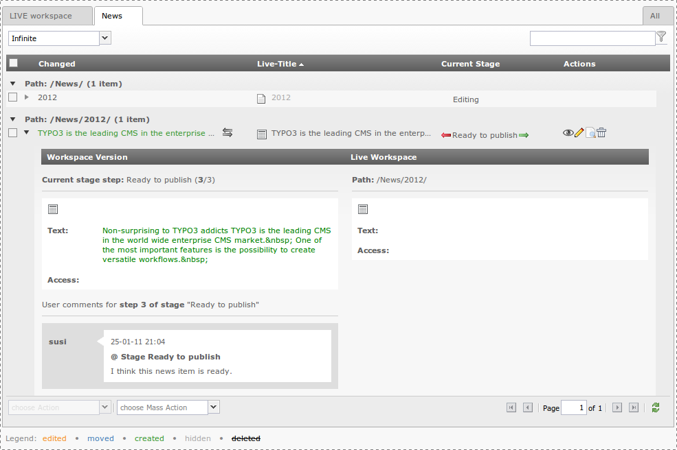

   An overview of the changes in the workspaces module

This view shows you the live version and the workspace version. If you
open the detail view of a change you can see a comparison view which
helps you to understand what has changed in the draft version.

(In the example the text was added in the workspace version). You can
also raise the stage of the content for review, you can publish,
preview etc.

**Previewing content** in the workspace is easy. You can use the eye
icon anywhere while working in a workspace, for example from the page
module or with the save & view button.

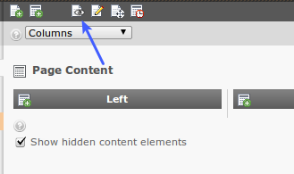

   Previewing the page from the Web > Page module

   Clicking save & view will trigger a preview

You can also directly use the workspaces module:

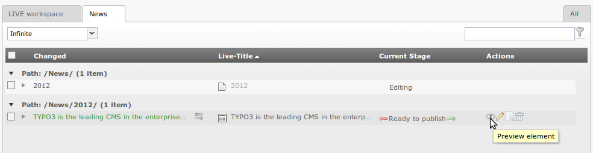

   Calling the preview from the workspaces module

The workspaces preview is a simultaneous view of the live and
workspace version. The default selection is to show the workspace
version and to display a slider with which it is possible to change
the display to the live version. With the select box in the upper
right corner you can change the mode to - for example - vertical split:

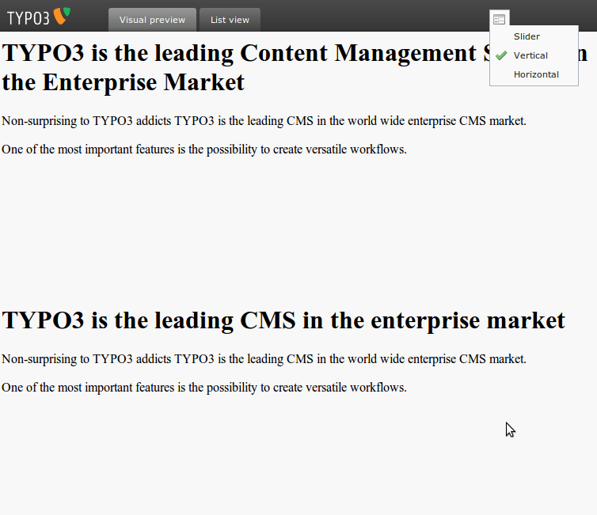

   Changing the workspaces split preview

The custom Workspace is adequately described in the content sensitive
help so no more details will be given here.

The workspace technology offers a simple scheme for **staging content
through review to publication**. In the Workspace Manager you can
"raise content" to the next level and attach a comment while doing so:

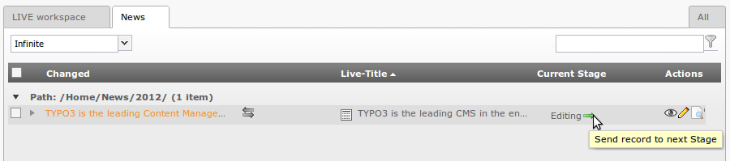

   Sending a change to the next review stage

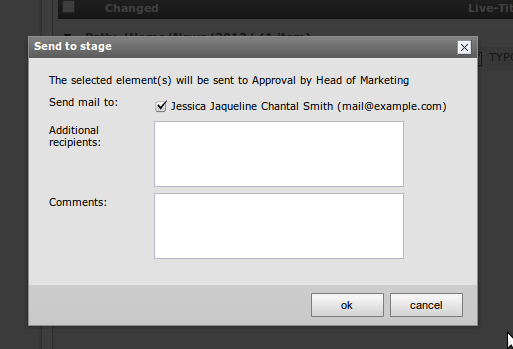

   Adding a message upon sending to the next stage

The stage in this case is raised to "Approval by Head of Marketing"
and will be reflected in the interface:

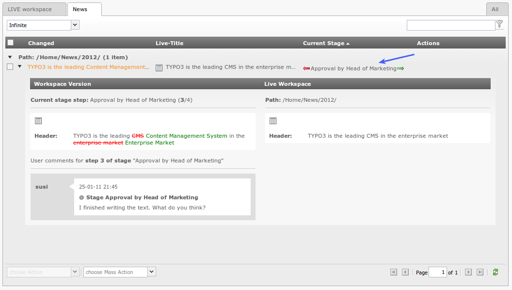

   The change is now in the next stage

If the change that was made is rejected by the reviewer of the next
stage it can be sent back with a comment, so that the "creator" of the
content can adjust the element:

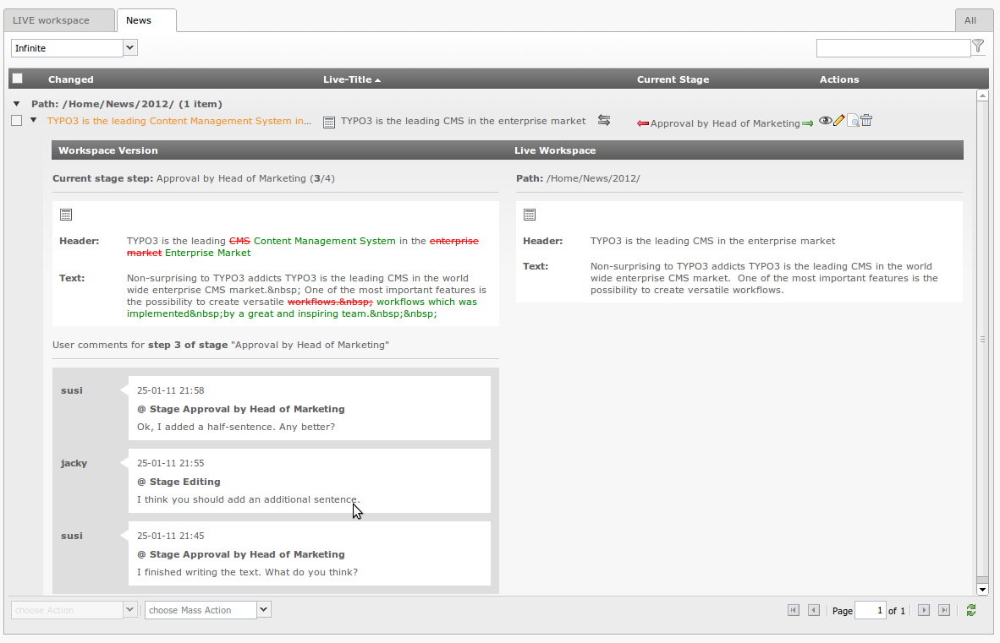

   The rejected change and the ensuing discussion

If the reviewer is ok with the change, he can send the change on to
the next stage – either another review level or the "ready to publish"
state. Depending on the configuration of the workspace the workspace
owner or any member with access to the LIVE workspace can then publish
the change. Note that it is possible for anyone that is allowed to
publish to directly publish from any stage. A change does therefore
not necessary need to have been in all stages.

Sending elements to another stage can either be done individually for
each element with the arrow buttons in an elements row or via the
select box in the bottom left corner. You can select multiple rows by
using the checkbox of each row and then select the action you want to
do:

   The rejected change and the ensuing discussion

You can also publish, swap or discard a **whole workspace** at once with
the second select box on the bottom. This select box – called "Mass
Actions" - is only active when no element is selected:

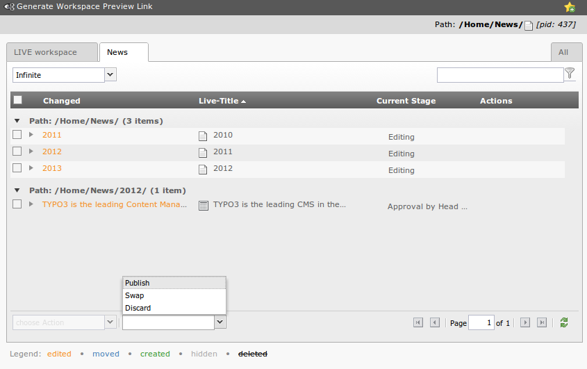

   The mass action selector

.. important::

   It is worth stating again that the mass actions affect the **whole workspace**,
   which means even the changes that may not currently be visible in the
   workspaces module because they are not within the currently selected
   branch in the page tree.

For each element in the list you can access **control buttons** for
*swap*, *send to previous/next stage*, *show preview*,
*edit element*, *open the element in the page module* and *discard changes*.

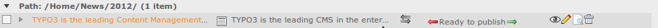

   The control buttons for a given change set

In the Web > List view of the live workspace you can see which elements have
versioned counterparts:

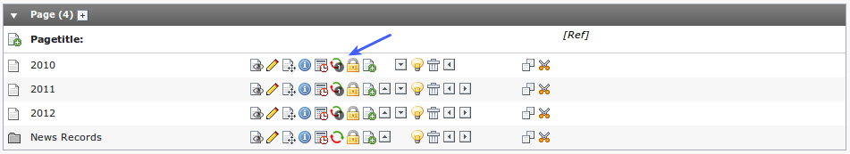

   Elements with several versions are clearly marked in the Web > List view

The **system log** will also reflect operations in the workspace. The
"User" column is tagged with the id of the workspace in which the
action took place:

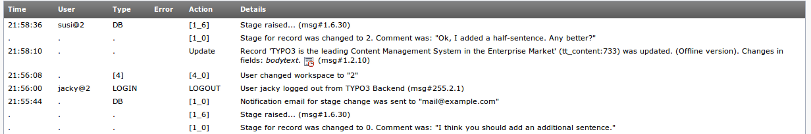

   Log of workspaces-related operations

**Setting up access to workspaces:** To give a user access to the live
workspace you have to check the corresponding checkbox in his backend
user record or in his backend user group record:

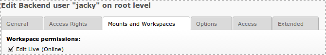

   Setting workspaces permissions

For :ref:`custom workspaces <custom-workspace>` users or groups are assigned
directly in the configuration record of the workspace:

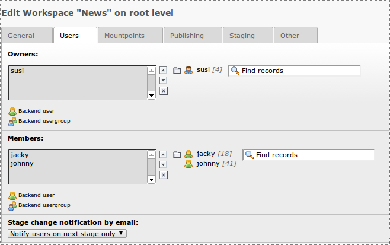

   Setting permissions for a custom workspace

.. tip::

   In most typical cases the average backend user only works in a custom
   workspace and therefore cannot change live content before a supervisor
   with access to the Live workspace will enter the backend and publish
   the workspace content.

