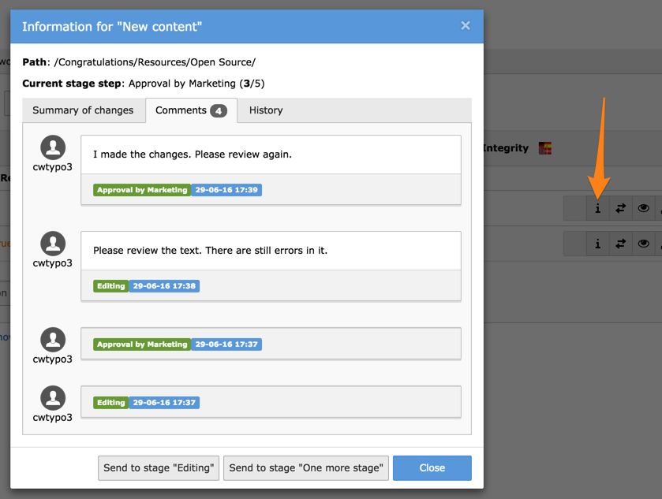
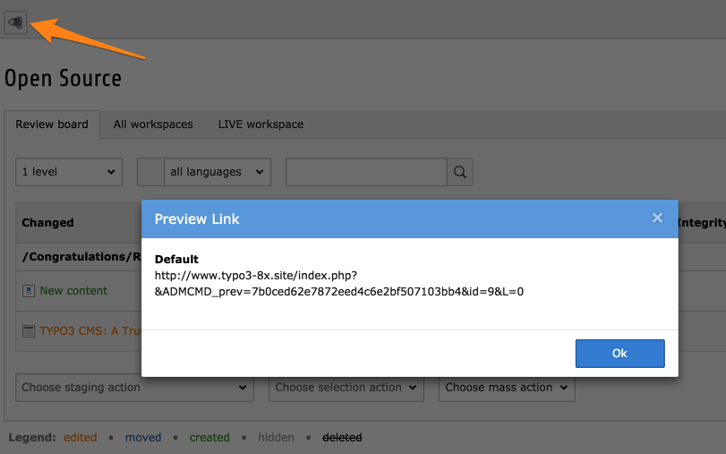
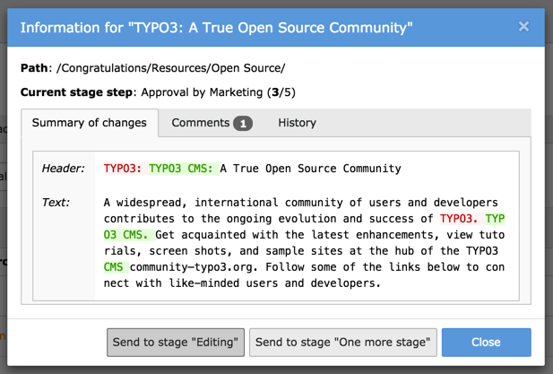
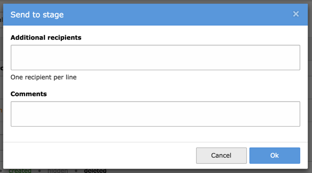
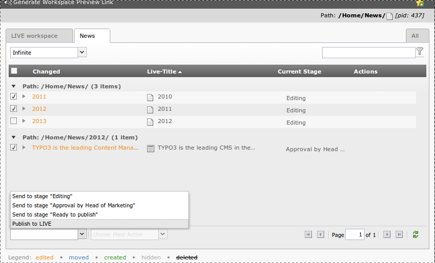

.. include:: /Includes.rst.txt

.. _users-guide:

Users Guide
-----------

This section covers the workspace-related features in the
backend.

Most significantly workspaces have a selector box in the upper right
corner of the backend.

.. figure:: ../Images/WorkspaceMenu.png
   :alt: Workspace selector

   The workspace selector in the top bar

In this selector box you can choose between the workspaces available.
The whole backend reloads each time one changes workspace.

As a visual reminder that you are currently in a workspace, a section
of the top bar changes to a different color:

.. figure:: ../Images/WorkspaceIndicator.png
   :alt: Workspace indicator

   Activation of a workspace highlighted in the top bar

As soon as you start editing inside a workspace, new versions
get created for you.

A page which has a change in the current workspace is highlighted in
the page tree:

.. figure:: ../Images/ModifiedPageHighlight.png
   :alt: Highlighted page

   Modified page highlighted in the page tree

The module **WEB > Workspaces** allows you to monitor changes in a
workspace:

.. figure:: ../Images/WorkspaceModuleOverview.png
   :alt: Workspace module overview

   An overview of the changes in the workspaces module

First of all you get an overview of all changes in the current
workspace and the current page (or below, if so defined). This is
also the control center for reviewing, editing and sending any change
to another stage. All these operations are detailed below. The icons
correspond to the following operations:

#. *Show changes*: opens the detailed view

#. *Swap*: swaps the workspace and live version of that record

#. *Preview element*: opens the preview window

#. *Edit element*: edits the record

#. *Open version of page*: switches to the **WEB > Page** module

#. *Discard*: discards the change

#. selects the record. Once a records is selected, the two action
   menus at the bottom left become active.

The third menu at the bottom of the view is called the "mass action"
menu (:ref:`detailed below <users-guide-mass-action>`).

You can also switch workspace by clicking on the corresponding tab.

The detailed view opens in a popup with the full history information.

   Viewing all details about a change

.. _users-guide-preview:

Previewing content
^^^^^^^^^^^^^^^^^^

When in a workspace, as soon as you hit the "View webpage" button
or use the "Save and view page" action, you will access the workspace
preview. This is also possible straight from the *Workspaces* module,
when clicking on the "Preview element" button.

The workspaces preview is a simultaneous view of the live and
workspace version. The default selection is to show the workspace
version and to display a slider with which it is possible to change
the display to the live version. With the select box in the upper
right corner you can change the mode to - for example - vertical split:

.. figure:: ../Images/WorkspaceSplitPreview.png
   :alt: Workspace split preview

   Changing the workspaces split preview

Clicking on the "List view" tab leads you to the same view as the
*Workspaces* module.

.. _users-guide-preview-link:

Generating a preview link
^^^^^^^^^^^^^^^^^^^^^^^^^

An additional feature of workspace is that a special preview link
can be generated. It can be shared with anyone, even with people
who have no access whatsoever to the TYPO3 CMS installation. With
this link, people are able to view the page as it appears in the
given workspace.

Simply hit the "Generate page preview links" button in the docheader
and copy the link from the popup window:

   The preview link appears in a popup window

.. _users-guide-review-process:

Review process
^^^^^^^^^^^^^^

Sending a change to another stage in the review process is
achieved via the detailed view popup window:

   Sending a change to the previous or next stage

The change can either be sent to the next stage or sent
back to the previous one. Once a stage has been selected,
another popup window appears for entering a message:

   Adding a message upon sending to another stage

The messages are visible as comments in the change history.

Once the change reaches the "Ready to publish" stage, anyone with the
proper rights can publish it to the LIVE version, upon which it is
visible on the web site. Note that it is possible for anyone that is allowed to
publish to directly publish from any stage. A change does therefore
not necessary need to have been in all stages.

It is also possible to send a change to another stage by selecting it
in the overview and using the menu at the bottom left:

   Sending one or more changes directly to some other stage

.. _users-guide-mass-action:

The mass action menu
^^^^^^^^^^^^^^^^^^^^

You can also publish, swap or discard a **whole workspace** at once with
the third menu at the bottom. This select box – called "Mass
Actions" - is only active when no element is selected:

.. figure:: ../Images/MassActionsMenu.png
   :alt: Mass actions menu

   The mass action selector

.. important::

   The mass actions affect the **whole workspace**,
   which means even the changes that may not currently be visible in the
   workspaces module because they are not within the currently selected
   branch in the page tree.

.. _users-guide-log:

Workspace log
^^^^^^^^^^^^^

The **system log** will also reflect operations in the workspace. In the
"User" column the name of the workspace appears below the username:

.. figure:: ../Images/WorkspaceLogging.png
   :alt: Workspaces and logging

   Log of workspaces-related operations
